# Lambda Resilience Atelier

**An empirical study of Java Lambda cold-start failure modes and their mitigations.**

_v4.3 · Author: Alexis Nava ([@ae-lexs](https://github.com/ae-lexs)) · Region of record: `us-east-1` · Status: Complete_

> **Thesis.** Cold start is a **fail-slow** failure mode for Java Lambdas — slow but recoverable, invisible in steady-state benchmarks, and worst at the moment of greatest demand. It is addressable through a deliberate stack of mitigations whose cost-versus-effect curve must be **measured, not assumed**. This repository is the apparatus and the measurements that test that claim end to end.

---

## Table of contents

1. [Abstract](#1-abstract)
2. [Claims under test](#2-claims-under-test) — the citation surface
3. [Apparatus and method](#3-apparatus-and-method)
4. [Experiments and findings](#4-experiments-and-findings)
5. [Synthesis — six takeaways](#5-synthesis--six-takeaways)
6. [Design decisions](#6-design-decisions)
7. [Reproduce it yourself](#7-reproduce-it-yourself)
8. [How to cite](#8-how-to-cite)
9. [References](#9-references) · [License](#license) · [Changelog](#changelog)

---

## 1. Abstract

This is an **empirical study**, not a tutorial and not an opinion piece. Its unit of work is the *pre-registered experiment*: before any infrastructure was deployed, expected behavior was committed to a prospective architecture-and-decisions document (§6); the experiments were then run against real AWS infrastructure in `us-east-1`; and each load-bearing claim carries a **measured verdict** against that expectation.

Verdicts use three labels:

- **Confirmed** — the measurement matched the prediction.
- **Nuanced** — the direction held but the magnitude, cost, or boundary conditions differ materially from the naive expectation.
- **Corrected** — the measurement contradicted the prevailing assumption. *This is the highest-value outcome*: it is the reason to run the experiment instead of paraphrasing the documentation.

Of the nine claims tested, **five are Corrected** — a reminder that the received wisdom about Java Lambda cold start (that it can be estimated from the runtime, that observability is free, that one latency threshold captures resilience) does not survive contact with a dashboard.

The study spans eight modules: M01 establishes a baseline; M02–M04 build the mitigation hierarchy (observability → SnapStart → Provisioned Concurrency); M05 covers the parallel failure mode of database connection exhaustion; M06–M07 verify behavior under burst load and deliberate fault injection; M08 gates every future change operationally. A later **Phase-1** campaign re-measured the database tier with corrected instruments and added [LRA-09](#lra-09--an-explicit-shedder-cuts-cost-but-does-not-demonstrably-raise-goodput) — the one claim here tested against a prediction this study had itself pre-registered, rather than against received wisdom. The empirical findings in §4 are the receipts.

> [!note] On reporting a half-failed prediction
> LRA-09 is **Nuanced** because half of its prediction did not survive. That half is stated as prominently as the half that held, and so is the design choice that exposed it: the arms were run **A-B-B-A** rather than A-B, and a single arm pair showed a 1.90× goodput improvement that the full ordering dissolved to a statistically unsupportable 1.26×. A study that reported the confirming pair alone would not be doing something subtly different from this one.

---

## 2. Claims under test

Each claim has a stable identifier (`LRA-NN`) so it can be cited directly. Follow the link for the experiment, the instrument, the measured number, and the reasoning behind the verdict.

| ID | Claim under test | Prevailing assumption / prediction | Measured result | Verdict |
|---|---|---|---|---|
| [LRA-01](#lra-01--baseline-cold-start-is-not-predictable-from-the-runtime) | A Java Lambda's cold start can be estimated from JVM + framework version | 1.3–2.2 s (committed in §6) | **4,623 ms** | **Corrected** |
| [LRA-02](#lra-02--observability-is-not-free) | Distributed-tracing instrumentation is effectively free | Negligible overhead | **+4,200 ms** cold start, **+131 MB** | **Corrected** |
| [LRA-03](#lra-03--snapstart-is-the-cheap-but-incomplete-default) | SnapStart restores a Java Lambda in the low hundreds of ms | Sub-second restore | 737 ms warm · **1,703 ms** first cache-cold | **Nuanced** |
| [LRA-04](#lra-04--provisioned-concurrency-is-the-deterministic-eliminator) | Provisioned Concurrency eliminates cold start under burst | Eliminated, at a standing cost | Eliminated under 0→500 VU · **$0.72/day** | **Confirmed** |
| [LRA-05](#lra-05--a-right-sized-function-still-fails-on-a-downstream-ceiling) | A right-sized function cannot fail on a downstream limit | Compute sizing is the whole story | Aurora **≈188-conn** ceiling at 1 ACU saturates instantly | **Confirmed** + mechanism · **⚠ under re-measurement** |
| [LRA-06](#lra-06--single-invocation-benchmarks-misrepresent-production) | A single-invocation benchmark represents production latency | Representative | p95 **110 ms** vs max **24,690 ms** (**224×**) | **Corrected** |
| [LRA-07](#lra-07--one-sla-threshold-does-not-capture-resilience) | One latency SLA threshold captures resilience | Sufficient | Latency and error injection hit **different** metrics | **Corrected** |
| [LRA-08](#lra-08--adot-and-fis-cannot-instrument-the-same-function) | ADOT and FIS can instrument the same function | They coexist | Exec-wrapper slot is **mutually exclusive** | **Corrected** |
| [LRA-09](#lra-09--an-explicit-shedder-cuts-cost-but-does-not-demonstrably-raise-goodput) | A circuit breaker at the pool boundary raises goodput **and** cuts cost past the knee | Both, per this study's own §IX prediction | Cost **2.37× cheaper per success** (ranges separate) · goodput 1.26× but **ranges overlap** | **Nuanced** |

> [!warning] One claim is under re-measurement — 2026-07-20
> A Phase-0 instrumentation pass re-ran the database experiment on a re-baselined apparatus: Performance Insights enabled, Aurora pinned at 2 ACU, and a load driver that actually reaches the database. **[LRA-05](#lra-05--a-right-sized-function-still-fails-on-a-downstream-ceiling) is flagged, not withdrawn.** Its central instrument claim — that the connection *count* is blind and the *queue* for a connection is the true saturation signal — is **confirmed and quantified** by re-measurement. What is in question is the supporting evidence, and one framing.
>
> **The connection-count evidence may not measure database work.** HikariCP is configured `minimum-idle=2` per container, so roughly 74 warm containers produce ~148 idle connections **at Spring startup, without a single request touching the database**. The original exhibit's "≈148 connections" may therefore be counting containers × pool minimum rather than load.
>
> **Exhaustion is real but arrives late — and the ceiling figure was wrong.** `DatabaseConnections` is published under two dimension sets that disagree by ~2×: the proxy-scoped series peaked at **161** (its own per-scope limit) while Aurora's own count peaked at **324**, and `DBLoad` of 312 active sessions corroborates the Aurora figure. Reading the proxy series alone understates connections by half. Either way the ordering holds: goodput collapsed from 1,152 req/s to 28 req/s well before any connection limit bound. The binding constraint at the knee is database CPU (`DBLoad` 48 against a 1-vCPU instance), not connection count. The distinction is not pedantic: a pool ceiling is a queue (latency rises, throughput holds) while congestive collapse is not (throughput falls), and enlarging the pool helps the first while actively worsening the second.
>
> 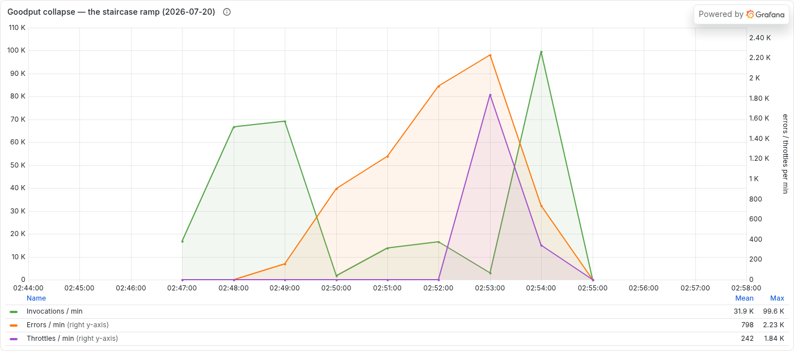
>
> *Goodput collapse. Invocations (green, left axis) peak at **69.1K/min** at 02:49 and crash to **1.7K** one minute later, while errors (orange, right axis) climb to **2.23K/min**. Throttles (purple) hold at zero until 02:53 — the account-concurrency confound is confined to the top of the ramp, so the collapse itself is database-attributable. Errors and throttles carry their own axis because they are ~45× smaller than invocations; sharing one axis flattens the two series that carry the argument.*
>
> 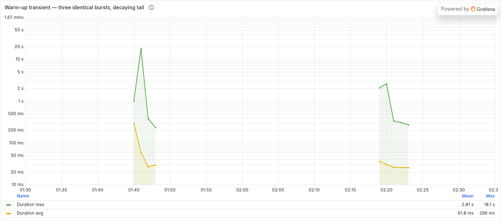
>
> *The warm-up transient, on a log axis. Identical bursts on the same stack, minutes apart: `Duration` max reaches **18.1 s** on the first burst after cluster creation (01:45) and only **~2.5 s** on the repeat (02:19), while average duration falls from 296 ms to the low tens of ms. Same load, same code — the difference is entirely how recently the cluster was created. This is why the standing protocol is to discard the first burst after any deploy.*
>
> **Retracted flag.** An earlier revision of this note also flagged [LRA-06](#lra-06--single-invocation-benchmarks-misrepresent-production). That was an error and is withdrawn: LRA-06 was measured on the **M04 stack driving `/health`**, which involves no database at all, so an Aurora warm-up transient cannot explain it. Its bimodality has its own instrumented mechanism — PC spillover past 200,000 invocations, shown in its own exhibit. The flag was raised by generalizing an M05-stack finding onto an M04-stack claim without checking which stack produced it. Recorded rather than quietly deleted, because a citable study should show where its own review went wrong.
>
> Re-measurement is specified in `PHASE_0_SMOKE_FINDINGS.md`. Until it completes, cite LRA-05 with the caveat attached.
>
> **Reproduction cost warning.** The Phase-1 re-measurement consumed **1,870,762 Lambda GB-seconds across 1,473,712 invocations** — 4.7× the monthly AWS Free Tier allowance — at roughly **$25–32** for a single evening. The cost driver is not the infrastructure but the invocations: a Lambda blocked waiting on a saturated database is billed for the waiting, so an experiment designed to induce latency inflates its own bill, and spend rises as throughput falls. Price a reproduction in GB-seconds using the *degraded* latency you intend to cause, not the healthy latency, and check remaining free tier before starting.
>
> The later [LRA-09](#lra-09--an-explicit-shedder-cuts-cost-but-does-not-demonstrably-raise-goodput) campaign came in at **≈ $7.6** for 655,163 GB-seconds across 1,108,604 invocations, because reserved concurrency bounds the worst case arithmetically: `C × T × memoryGB × $0.0000166667` is a ceiling no load-generator misbehavior can exceed. Two cautions from it. **The dominant term moves:** once Lambda sits inside the free tier, **API Gateway** became the largest per-request line item at $1.84 for 1.84M requests, so a cost shape reused from an earlier run will mis-estimate. And a **pre-run estimate must be re-derived when the design changes** — this one was $2–3, revised to $10–14 when the apparatus was reconfigured to reproduce collapse, and the revision is the number that held.

---

## 3. Apparatus and method

### System under test

The deployed system is the *union* of all eight modules; each composes additively onto the previous. M01 establishes Lambda + VPC + API Gateway; M02 attaches the ADOT layer; M03 enables SnapStart; M04 attaches Provisioned Concurrency; M05 adds RDS Proxy + Aurora; M06–M07 are observation regimes (no new infrastructure); M08 wired CI/CD (deploy pipeline since removed — see §7). The CDK app exposes **one stack per module**, so any module can be deployed and torn down independently.

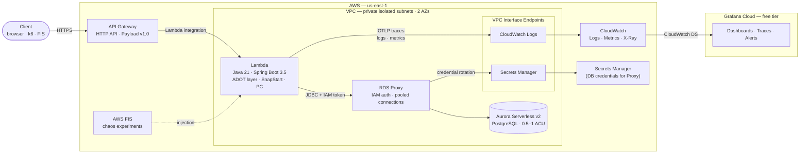

### Instruments — how each number was measured

The measurement method is the load-bearing part of the study; a number without an instrument is an assertion. Every finding in §4 names the instrument that produced it.

| Instrument | Measures | Note on fidelity |
|---|---|---|
| **CloudWatch Logs Insights** over `REPORT` / `INIT_REPORT` / `RESTORE_REPORT` lines | `@initDuration`, `Restore Duration`, `Billed Restore Duration`, warm `@duration` | `InitDuration` is a **log field, never a CloudWatch metric**. `@restoreDuration` auto-parse is unreliable — parse the raw `@message` instead. |
| **ADOT Lambda layer → Grafana Cloud** | p50/p95/p99 invocation duration, concurrent executions, error rate, PC utilization/spillover | CloudWatch panels require **Match Exact = on**, or metric search returns duplicate function-level + account-level series. |
| **CloudWatch metrics** (`AWS/Lambda`, `AWS/RDS`) | `ProvisionedConcurrencyUtilization`, `ProvisionedConcurrencySpilloverInvocations`, Aurora `ServerlessDatabaseCapacity`, `DatabaseConnections` | 60 s resolution — adequate here because the effects persist for minutes, not seconds. |
| **k6 `stages` API** | throughput, p95/max latency, `http_req_failed`, `checks` under a controlled `0→500`-VU burst | Multi-threshold (`p(95)<500ms`, `http_req_failed<1%`, `checks>95%`) — different thresholds catch different failure modes (see [LRA-07](#lra-07--one-sla-threshold-does-not-capture-resilience)). |
| **AWS FIS Lambda actions** | system behavior under injected latency (`invocation-add-delay`) and errors (`invocation-error`) | Extension is **not** auto-injected; requires deploy-time prerequisites — and forecloses ADOT on the same function ([LRA-08](#lra-08--adot-and-fis-cannot-instrument-the-same-function)). |

> **Measurement standard.** These instruments follow a shared grammar: the four golden signals as **RED** (rate · errors · duration, per boundary) + **USE** (utilization · saturation · errors, per resource), bound by **Little's Law** (`L = λ × W` — concurrency = throughput × latency). This study already emits much of it — `ConcurrentExecutions` *is* `L`; PC utilization/spillover *is* saturation. The signal being deepened is DB-tier **saturation**: RDS Proxy `DatabaseConnectionsBorrowLatency` (the queue for a pooled connection) and Aurora Performance Insights `DBLoad` / Average Active Sessions vs the Max vCPU line.

---

## 4. Experiments and findings

Cold-start budget across modules. Every number is a direct measurement from `us-east-1`, not an estimate.

| Module | Configuration | Init (cold) | Restore | Warm | Memory | Standing cost |
|---|---|---|---|---|---|---|
| **01 Baseline** | Java 21 + Spring Boot 3.5 + VPC | **4,623 ms** | — | ≈ 5 ms | 182 MB | $0 |
| **02 Observability** | + ADOT Java agent layer | **8,821 ms** avg (+4,200 ms) | — | 580–620 ms (+575 ms) | 313 MB (+131 MB) | $0 |
| **03 SnapStart** | + SnapStart + Spring CRaC checkpoint | 12,744–13,344 ms one-time at publish | **737 ms warm · 1,703 ms first cache-cold** | 26–27 ms | 313 MB | $0 |
| **04 Provisioned Concurrency** | + 2 PC × 1024 MB + Application Auto Scaling | eliminated under burst | — | ≈ 5 ms | 313 MB | **$0.72/day** |
| **05 Database Resilience** | + Aurora Serverless v2 + RDS Proxy + IAM auth | (unchanged from M04) | (unchanged) | — | — | + Aurora ACU + Proxy + SM endpoint ≈ $1.20/day idle |
| **06 Load Testing** | M04 stack + 0→500 VU burst-ramp × 80 s | 342,872 invocations · **4,283 req/s** | — | **p95 = 110 ms · max = 24,690 ms** | — | + ≈ $0.40–0.50 per burst |
| **07 Chaos** | parallel `LraChaosStack` (no ADOT) + FIS | (unchanged from M04) | — | depends on injection | — | + FIS $0.10/action-min + duplicated stack |
| **08 CI/CD** | GitHub Actions CI (`Gradle test` + `CDK synth`). Deploy pipeline + OIDC role **removed 2026-07-20** — see §7 | — | — | — | — | $0 |

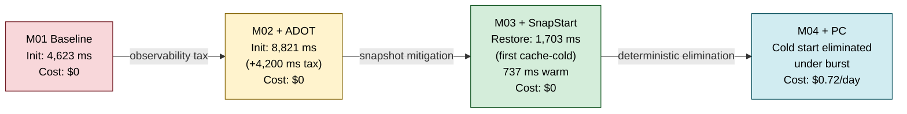

Each finding below states the **claim**, the **instrument**, the **measurement**, and the **verdict**.

### LRA-01 — Baseline cold start is not predictable from the runtime

**Instrument:** CloudWatch Logs Insights over `@initDuration`. **Prediction (committed in §6):** 1.3–2.2 s.

Java 21 + Spring Boot 3.5 cold start landed at **4,623 ms** — more than double the committed prediction. Root cause: the `spring-cloud-function-serverless-web` transitive dependencies pulled in by `aws-serverless-java-container-springboot3:2.1.5` instantiate far more beans than the estimate assumed. Framework and dependency-tree drift dominate the cold-start budget far more than JVM version does.

> **Verdict: Corrected.** Production Java Lambda cold-start estimates must be *measured*. A number derived from the runtime version alone is off by a factor of two.

### LRA-02 — Observability is not free

**Instrument:** CWLI (`@initDuration`, `@maxMemoryUsed`) with and without the ADOT layer.

Attaching the ADOT Java agent layer added **≈ 4,200 ms** to cold start (4.6 s → 8.8 s) and nearly doubled memory (**182 MB → 313 MB** at a 1024 MB allocation). The instrumentation is the cost paid for visibility — and that visibility is what makes every later delta in this study reproducible and honestly comparable. But "free observability" is a false framing: you buy it with cold-start budget and memory.


> **Verdict: Corrected.** Instrumentation carries a quantifiable cold-start and memory tax. Anyone budgeting for a chaos-validated workload should also read [LRA-08](#lra-08--adot-and-fis-cannot-instrument-the-same-function) — choosing ADOT has a second, architectural cost.

### LRA-03 — SnapStart is the cheap-but-incomplete default

**Instrument:** CWLI parsing raw `RESTORE_REPORT` / `REPORT` `@message` lines (the auto-parsed `@restoreDuration` field is unreliable).

The Firecracker microVM snapshot cuts restored cold start from ≈ 9 s (with ADOT) to **737 ms cache-warm** and **1,703 ms on the first cache-cold restore**, with the actual handler running in 58–62 ms inside the restore window. Snapshot *capture* is a one-time **12–13 s** cost at publish (often two snapshots per version due to multi-AZ replication), amortized over every subsequent restore. CRaC `beforeCheckpoint` / `afterRestore` hooks are mandatory for any state the snapshot would otherwise freeze incorrectly — open connections, IAM tokens, cached DNS.


> **Verdict: Nuanced.** SnapStart works, but "low-hundreds-of-ms restore" only holds for cache-warm restores; the *first* cache-cold restore is ≈ 1.7 s, and capture is a real up-front cost. Use SnapStart alone when 1.7 s meets the latency contract; escalate otherwise.

### LRA-04 — Provisioned Concurrency is the deterministic eliminator

**Instrument:** CloudWatch `ProvisionedConcurrencyUtilization` and `ProvisionedConcurrencySpilloverInvocations` (Match Exact on).

With 2 PC × 1024 MB, cold start is **eliminated under burst** at a standing cost of **$0.72/day**. Application Auto Scaling makes PC sizing dynamic — schedule-based for known peaks, metric-based on `ProvisionedConcurrencyUtilization` for unknown ones. The decision criterion is mechanical: use PC when worst-case burst cold start exceeds the latency contract; use SnapStart alone when its restore time is already below it.


> **Verdict: Confirmed.** PC eliminates cold start deterministically. The trade is money for latency certainty, and the trade is legible on a single panel.

### LRA-05 — A right-sized function still fails on a downstream ceiling

**Instrument:** CloudWatch Aurora `ServerlessDatabaseCapacity` (ACU) and `DatabaseConnections`; CWLI over HikariCP pool activity.

Connection exhaustion is the second fail-slow mode, and it is orthogonal to compute sizing. Aurora Serverless v2 at 1 ACU has a **≈ 188-connection ceiling**; 1,000 concurrent Lambda invocations each opening one connection saturate it instantly. This is **Little's Law** (`L = λ × W`): concurrency on the database = invocation rate × time-in-system, so 1,000 in-flight invocations is an `L` that blows straight past the ~188 ceiling — and the connection *count* is capped and therefore blind above it, exactly as CRA-04 found on its pool. The true saturation signal is the **queue for a pooled connection** (RDS Proxy `DatabaseConnectionsBorrowLatency`), not the count. **RDS Proxy** multiplexes many client connections onto a small Aurora pool. The IAM-token-via-proxy pattern carries a subtle mechanism requirement: because SnapStart freezes the token in the snapshot, the token **must be refreshed on every pool borrow**, not once at init — discovered by failed deploys, not by documentation.

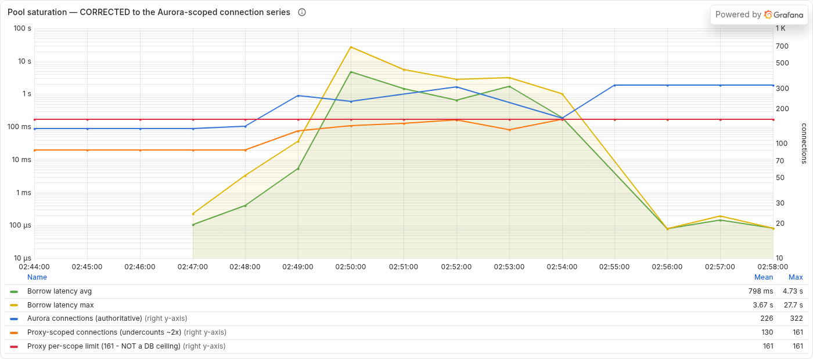

*Re-rendered 2026-08-04 with the §XII scope correction **drawn rather than described**. Three connection series are now plotted together on the right axis: Aurora's own count (blue, peak **322**), the proxy-scoped count (orange, peak **161** — about half), and the flat proxy per-scope limit (red, **161**). The blue line sits **above** the red line for most of the window, which is the whole point: 161 was never the database's ceiling. Meanwhile borrow latency (left, log µs) reaches **27.7 s max at 02:50**, two minutes **before** the proxy count touches its limit at 02:52. The queue saturates first, the count saturates last, and the count was also scoped to the wrong entity. That ordering is the argument for reading pool-wait rather than pool-occupancy.*


> **Verdict: Confirmed, with a mechanism correction.** The ceiling is real and compute sizing does not touch it; the SnapStart-plus-IAM-token interaction requires per-borrow refresh, which no single doc page states.

### LRA-06 — Single-invocation benchmarks misrepresent production

**Instrument:** k6 `stages` API, 0→500 VU burst-ramp over 80 s; ADOT → Grafana for concurrency and percentiles.

Across **342,872 invocations** under the burst, throughput hit **4,283 req/s** with **p95 = 110 ms but max = 24,690 ms — a 224× ratio**. The system is **bimodal**: warm invocations cluster near the median while cold-starting containers form a long upper tail. A single-invocation benchmark sees only the warm mode and systematically understates user-facing impact.


> **Verdict: Corrected.** Production latency is bimodal under burst. The k6 `stages` API and a multi-threshold validation structure are not optional; single-invocation numbers are not evidence.

### LRA-07 — One SLA threshold does not capture resilience

**Instrument:** AWS FIS Lambda actions (`invocation-add-delay`, `invocation-error`) against the same k6 burst that passed cleanly in M06.

FIS injected (a) 5,000 ms latency on 50 % of invocations, then (b) HTTP 500 on 10 % of invocations. The same three-threshold k6 run that passed in [LRA-06](#lra-06--single-invocation-benchmarks-misrepresent-production) showed an asymmetry: **latency injection collapsed goodput while leaving the error rate at zero**, and **error injection spiked the error rate while leaving latency unchanged**. A single-threshold SLA would have declared one of the two failures a pass.

> **Verdict: Corrected.** Resilience is a multi-dimensional property. Latency and error budgets fail independently; validating one is not validating the system.

### LRA-08 — ADOT and FIS cannot instrument the same function

**Instrument:** deploy-time observation — Lambda honors exactly one `AWS_LAMBDA_EXEC_WRAPPER`.

ADOT's exec wrapper (`/opt/otel-handler`) and FIS's chaos wrapper (`/opt/aws-fis-bootstrap`) occupy the **same, single** exec-wrapper slot and are mutually exclusive. A chaos-validated production stack therefore requires either a parallel non-ADOT stack (the `LraChaosStack` in this repo) — doubling infrastructure cost during validation and forfeiting distributed traces on the chaos function — or a deploy-time wrapper toggle. Neither service's documentation advertises the conflict; it surfaced only when both wrappers were configured on one function.

> **Verdict: Corrected.** This is an undocumented architectural constraint. It is the second, hidden cost of choosing ADOT for a workload you also intend to chaos-test ([LRA-02](#lra-02--observability-is-not-free)).

### LRA-09 — An explicit shedder cuts cost but does not demonstrably raise goodput

**Instrument:** Lambda `@billedDuration` from `REPORT` lines via CloudWatch Logs Insights (the quantity AWS actually charges for, not a client-side proxy); k6 status-code counters for goodput; `AWS/RDS` `DBLoad` and `DatabaseConnectionsBorrowLatency` for the database tier. Apparatus: `resilience4j` circuit breaker at the HikariCP borrow boundary, exposed at `/db-breaker` against the unguarded `/db`, both calling one shared `DbQuery` component so workload constancy is structural rather than remembered.

This claim is unusual in this study: the prediction was **pre-registered by this study itself**. A Phase-1 re-measurement observed that Lambda's concurrency cap was acting as an *accidental* load shedder — throttled requests are refused in milliseconds instead of occupying a Lambda for seconds of borrow-wait — and predicted that a **deliberate** shedder should raise goodput *and* cut cost at identical offered load past the knee. Design: **A-B-B-A**, 1,600 rps offered, 3-minute arms, reserved concurrency 900, with recovery between arms gated on a 400 rps probe rather than a timer.

| Arm | Endpoint | Goodput | GB-seconds | Invocations | Avg billed | GB-s / success |
|---|---|---|---|---|---|---|
| A1 | `/db` | 256.4/s | 150,680 | 58,312 | 2,584 ms | 3.265 |
| B1 | `/db-breaker` | 486.7/s | 89,276 | 211,392 | 422 ms | 1.019 |
| B2 | `/db-breaker` | 355.0/s | 74,431 | 217,263 | 343 ms | 1.165 |
| A2 | `/db` | 411.1/s | 142,056 | 82,529 | 1,721 ms | 1.920 |

Paired by treatment, with replicate **ranges** stated because n = 2 per arm does not support anything stronger:

| Measure | Control [range] | Breaker [range] | Ratio | Ranges |
|---|---|---|---|---|
| GB-s per success | 2.593 [1.920 – 3.265] | 1.092 [1.019 – 1.165] | **0.42×** | **separate** |
| Total GB-seconds | 146,368 | 81,853 | 0.56× | **separate** |
| Goodput | 333.8/s [256.4 – 411.1] | 420.9/s [355.0 – 486.7] | 1.26× | **overlap** |

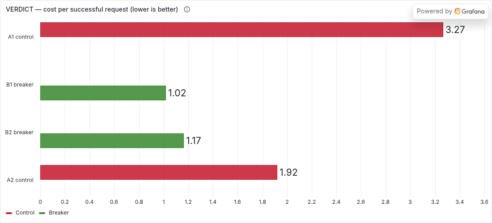

*The confirmed half, and the reason it is confirmed. Both breaker arms (green, 1.02 and 1.17) sit below both control arms (red, 1.92 and 3.27). The treatments separate cleanly, so the cost effect is not an artifact of which arm ran when.*

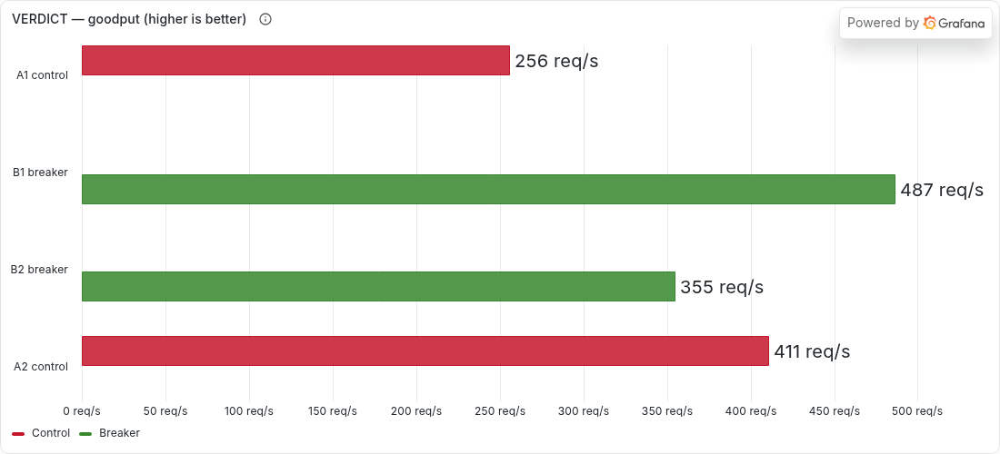

*The half that failed, drawn so it cannot be glossed. The bars **interleave**: B2 (green, 355 req/s) is beaten by A2 (red, 411 req/s). Comparing only the best breaker arm against the worst control arm gives 1.90× and looks like a result; the full ordering gives 1.26× with overlapping ranges and does not support the claim. This chart is in the study because the temptation to report the first comparison is exactly what the A-B-B-A design exists to defeat.*

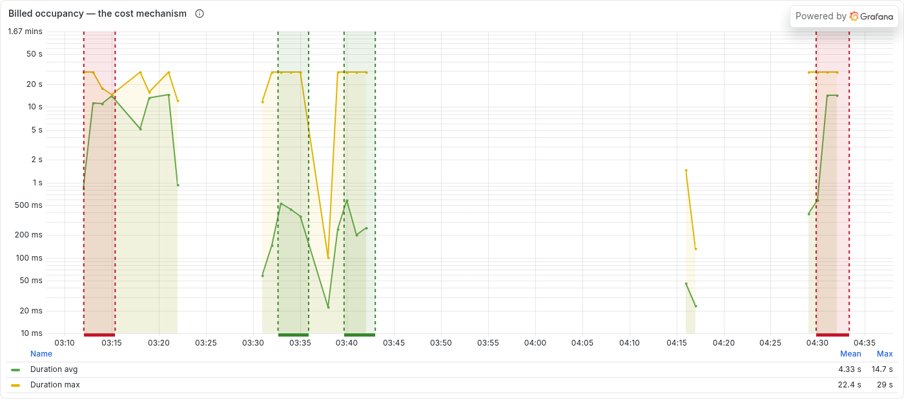

*The cost mechanism, and the reason the cost half of the prediction held. Red regions are control arms, green are breaker arms. A Lambda blocked in HikariCP borrow-wait is billed for the waiting: control invocations run into the 10 s pool timeout and the 29 s function timeout, breaker invocations refuse in milliseconds. Lines break across the recovery gates because Lambda publishes metrics only while invoked — those gaps are genuinely unmeasured, not zero.*

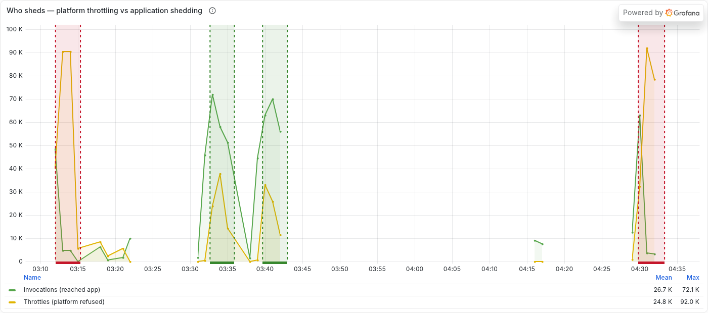

*The result nobody predicted. Breaker arms were invoked **3.6× more often** than control arms while costing 44% less. Shedding fast drains concurrency; drained concurrency stops the platform throttling; and far more requests then reach application code. The breaker does not reduce load on the system — it **moves the shedding decision from the platform to the application**, and an application rejection is one you can shape with a status code, a retry hint, or a fallback. A platform throttle is a 503 from infrastructure with nothing behind it.*

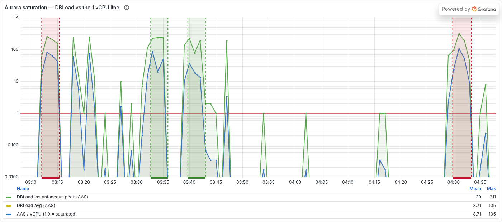

*Why the breaker is not a database protection. The instance presents **1 vCPU** at 2 ACUs, so `DBLoad` in active average sessions **is** the oversubscription factor. Instantaneous peaks reach **253 and 311 in the control arms and 232 and 225 in the breaker arms** — catastrophic in all four. The `Average` and `AAS / vCPU` series being numerically identical is itself the proof that the vCPU divisor is 1.*

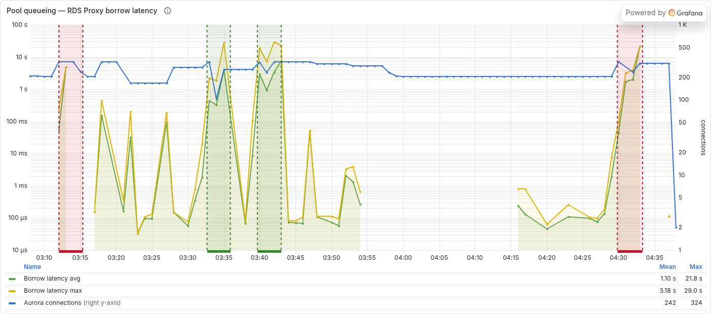

*Where the pressure actually appears. Borrow latency (left, log µs) moves three orders of magnitude while Aurora connections (right axis, counts) barely move — **214 → 232** across a reservation change from 200 to 900. Connection *count* is not the instrument; the *queue* for a connection is. This is [LRA-05](#lra-05--a-right-sized-function-still-fails-on-a-downstream-ceiling)'s central lesson, re-demonstrated on a different manipulation.*

**Two further results.**

**The knee belongs to the admission limit, not the database.** Holding offered load fixed at 1,200 rps and changing *only* the function's reserved concurrency: at **200** the system delivered 1,194.6 rps goodput with `DBLoad` 1.27 and 2,417 GB-seconds; at **900** the same load delivered 860.1 rps with `DBLoad` 8.48 and 26,876 GB-seconds. **Raising the concurrency limit lowered throughput and multiplied cost 11×**, because the concurrency limit is admission control on database work. A knee is therefore a property of *a system plus its admission limit*, never of the system alone — quoting one without the other is as incomplete as quoting a number without its instrument.

**Metastable collapse appears preventable.** Recovery between arms was gated on a probe at 400 rps, a rate the baseline served at 100.00%. After the control arm the gate needed **3 probes and ~8 minutes** (25.7% → 57.4% → 100% served); after each breaker arm, **1 probe**. Eight minutes after the control arm stopped, the system was still refusing 42% of requests at a rate it had served perfectly. Neither breaker arm latched at all. With a single control observation this is suggestive rather than established.

> **Verdict: Nuanced.** The cost half is confirmed and robust — both control replicates are worse than both breaker replicates, so the effect survives the ordering control rather than riding on it. The goodput half is **not established**: B2 (355.0/s) is worse than A2 (411.1/s), and the A1-versus-B1 pair alone would have supported a 1.90× claim the full design does not. The honest statement is that goodput did not measurably degrade and may have improved. Breaker tuning (window 5, trip at 3, 250 ms slow-call threshold) was reasoned from Lambda's per-container execution model, not searched — a sweep could plausibly move goodput off the fence.

> **Exhibit source.** Dashboard `lra-breaker-experiment` (`assets/grafana/lra-breaker-experiment.json`), rebuilt **after teardown**: CloudWatch retains metric data ~15 months independently of whether the resource still exists, so every panel above resolves against a deleted Aurora instance and a deleted function. The one panel that could not be rebuilt is the billed-duration *distribution* — it read from Logs Insights, and that log group was deleted with the stack. Its percentiles (control p50 199 ms / p95 13,529 ms against breaker p50 23 ms / p95 397 ms) survive in `loadtest/results/` and in the tables above.

---

## 5. Synthesis — six takeaways

These six takeaways are one instance of a single pattern: **the resilience mechanism and the failure amplifier are the same object; whether you get the protective or the amplifying face is decided by detection latency relative to how long the failure lasts.** Cold start is the *scaling* instance — a concurrency spike forces mass initialization → timeouts → retries → more cold starts; SnapStart and Provisioned Concurrency are ways to keep the mechanism on the protective side of that flip.

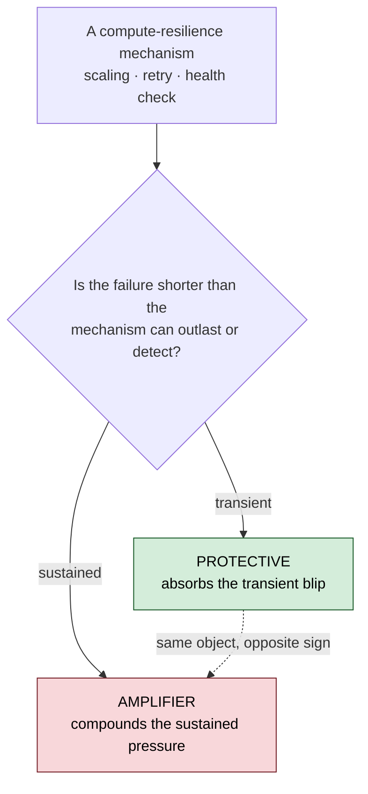

*The sign-flip: warm scaling absorbs a spike; cold scaling under init pressure amplifies it. The mitigation hierarchy below is how this study keeps detection ahead of the failure.*

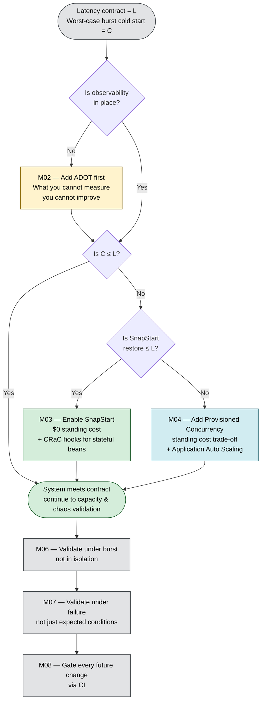

**1. Cold start is fail-slow, not fail-stop.** A cold-starting Lambda eventually returns the right answer, but breaches its latency budget at the moment of greatest demand — which is precisely when you can least afford it. The failure hides in steady-state benchmarks. [LRA-01](#lra-01--baseline-cold-start-is-not-predictable-from-the-runtime)'s 4,623 ms baseline is the proof.

**2. The mitigation hierarchy is hierarchical, not a menu.** Observability first, because what you cannot measure you cannot improve ([LRA-02](#lra-02--observability-is-not-free)). SnapStart is the cheap default where ≈ 1.7 s restore meets the contract ([LRA-03](#lra-03--snapstart-is-the-cheap-but-incomplete-default)). PC is the deterministic eliminator where it does not ([LRA-04](#lra-04--provisioned-concurrency-is-the-deterministic-eliminator)). Choosing out of order — PC before observability, or SnapStart without CRaC hooks — produces mitigations that look correct in isolation and fail under burst.

**3. Observability is bought, not given — and choosing ADOT forecloses chaos on the same function.** ADOT adds ≈ 4,200 ms of cold start and ≈ 131 MB. Worse, its exec wrapper is mutually exclusive with FIS's ([LRA-08](#lra-08--adot-and-fis-cannot-instrument-the-same-function)), so a chaos-validated stack needs a parallel non-ADOT deployment. Price the visibility before you buy it.

**4. Behavior under burst differs from behavior in isolation.** One cold start measured 4,623 ms; 342,872 invocations under a 0→500-VU ramp produced a 224× p95/max spread ([LRA-06](#lra-06--single-invocation-benchmarks-misrepresent-production)). Single-invocation benchmarks systematically understate impact.

**5. Capacity testing alone is insufficient — chaos verifies the SLA under deliberate failure.** Load tests reveal behavior at the operating envelope; chaos reveals behavior outside it. [LRA-07](#lra-07--one-sla-threshold-does-not-capture-resilience)'s injections caught failures a single-threshold SLA would have passed. The two together are the validation; either alone is not.

**6. Operational discipline is part of the resilience story — but a pipeline is itself attack surface.** Gating changes on the same baselines that proved the system works (`Gradle test` + `CDK synth`, containerized build for local/CI parity) is what keeps an SLA-meeting system from drifting out of compliance. That part held: `CDK synth` independently validated the Phase-0 capacity change. The deploy half did not. Its OIDC role carried `AdministratorAccess` scoped to a wildcard `sub` on a public repo, and it was **removed 2026-07-20** (§7). The corrected lesson: deployment discipline is necessary, and an under-scoped pipeline is a *resilience liability*, not a resilience control. Grant the federated identity least privilege and scope it to a branch or environment, or do not federate at all.

---

## 6. Design decisions

The full prospective rationale (Context · Considered Options · Trade-offs · Rejected) was committed **before** the codelab was implemented; the predictions in §2 come from that document. The compact summary below pairs each decision with its principal rejected alternative and — where the consequence only emerged during implementation — a post-hoc note.

| # | Decision | Choice | Principal rejected alternative | Post-hoc consequence |
|---|---|---|---|---|
| 1 | Runtime + framework | Java 21 + Spring Boot 3.5 | Quarkus native (eliminates SnapStart's didactic value) | Cold start landed at 4.6 s vs. predicted 1.3–2.2 s ([LRA-01](#lra-01--baseline-cold-start-is-not-predictable-from-the-runtime)); root cause `spring-cloud-function-serverless-web` transitive deps |
| 2 | Build tool | Gradle 8 + `com.gradleup.shadow:8.3.0` | Bazel (scope mismatch); Maven (host install) | Three Shadow transformations are mandatory: `mergeServiceFiles()`, `PropertiesFileTransformer` on `spring.factories`, `append()` on `spring/*.imports` |
| 3 | Infra-as-code | AWS CDK v2 (Java) — CLI `2.1118.2`, lib `2.250.0` | Terraform (HCL context switch); SAM (YAML ceiling) | CDK CLI requires Node.js; container needs `/var/run/docker.sock` mount for asset bundling |
| 4 | Local toolchain | Docker + Compose only on host | Dev Containers (IDE lock-in); Nix (package-manager prereq) | — |
| 5 | API Gateway type | HTTP API + Payload v1.0 | REST API ($3.50 vs $1.00 per M req) | Payload v2.0 does not work reliably with `getAwsProxyHandler` — pet-store canonical uses v1.0 |
| 6 | VPC egress | Interface Endpoints (Logs in M01; + Secrets Manager in M05) | NAT Gateway ($0.09/hr vs $0.02–0.04/hr) | Lambda-in-VPC has zero cold-start penalty since 2019 (Hyperplane ENIs) — VPC choice is a cost question, not a latency one |
| 7 | DB authentication | IAM token via RDS Proxy (two-hop) | Secrets Manager direct; password in env var | IAM tokens have a 15-min TTL; SnapStart freezes them — token must be refreshed per pool borrow ([LRA-05](#lra-05--a-right-sized-function-still-fails-on-a-downstream-ceiling)) |
| 8 | Observability | ADOT Lambda layer + Grafana Cloud free tier | X-Ray-only; CloudWatch-only | Exec wrapper mutually exclusive with FIS ([LRA-08](#lra-08--adot-and-fis-cannot-instrument-the-same-function)) — chaos needs a parallel non-ADOT stack |
| 9 | Load testing | k6 with `stages` API | JMeter (GUI workflow); Locust (gradual spawn) | — |
| 10 | Chaos engineering | AWS FIS Lambda actions | Custom throttle (FIS has no native Lambda throttle) | FIS extension is not auto-injected; needs FIS layer + 2 env vars + S3 bucket + IAM on both roles — the parallel `LraChaosStack` satisfies these |
| 11 | CI/CD | GitHub Actions CI only. OIDC deploy role **removed** | IAM user + access keys (rotation theater) | **Superseded 2026-07-20.** The OIDC role held `AdministratorAccess` on a wildcard `sub: repo:…:*` in a public repo — a standing admin grant. An OIDC pipeline is only as scoped as its `sub` claim; "no long-lived credentials" is the easy half. See §7 |

---

## 7. Reproduce it yourself

Prerequisites: Docker 24+ with Compose v2; AWS CLI v2 configured with SSO; an AWS account with CDK bootstrapped in your target region. **Nothing else runs on the host** — Java, Gradle, Node.js, the AWS CDK CLI, and k6 all live in containers (`docker-compose.yml`).

```bash
git clone https://github.com/ae-lexs/lambda-resilience-atelier.git
cd lambda-resilience-atelier
cp .env.example .env                             # set AWS_ACCOUNT_ID, AWS_REGION, AWS_PROFILE
aws sso login --profile "$(grep AWS_PROFILE .env | cut -d= -f2)"
docker compose build cdk
docker compose run --rm build ./gradlew :api:shadowJar --no-daemon
docker compose run --rm cdk cdk deploy LraBaselineStack --require-approval never
```

Each module's stack deploys independently (`LraBaselineStack`, `LraObservabilityStack`, `LraSnapStartStack`, `LraProvisionedConcurrencyStack`, `LraDatabaseResilienceStack`, `LraChaosStack`). `cdk destroy <StackName>` tears each down; every module ends with a teardown step to hold total cost under $5.

Load and chaos regimes:

```bash
API_URL=<your-endpoint> docker compose --profile loadtest run --rm k6 run /loadtest/burst-ramp.js
```

CI runs in GitHub Actions: `Gradle test` + `CDK synth`, with `contents: read` and no cloud credentials.

> [!warning] The deploy pipeline was built, then removed — 2026-07-20
> Module 08 originally added an OIDC-federated `workflow_dispatch` deploy job assuming `GitHubActionsRole`. **It has been deleted, along with the role and the `token.actions.githubusercontent.com` OIDC provider.** Two reasons, and the second is the important one.
>
> **It was unused.** Deploys run from the local Docker toolchain (Decision 4). The pipeline existed but nothing drove it.
>
> **Its trust policy was a standing admin grant.** `GitHubActionsRole` carried **`AdministratorAccess`**, trusted on `sub: repo:ae-lexs/lambda-resilience-atelier:*` — a wildcard matching any ref, any workflow, any environment, on a **public** repository. That was not directly exploitable (fork pull requests are not issued OIDC tokens, and the job was dispatch-only), but it was a permanent admin path into the account that survived regardless of whether any workflow referenced it. Deleting the workflow while leaving the role would have been strictly worse than doing nothing: the grant persists, with nothing using it and nobody watching it.
>
> The lesson revises Decision 11 rather than merely reversing it: **an OIDC pipeline is only as scoped as its `sub` claim.** "No long-lived credentials" is a genuine improvement over access keys, and it is also the easy half. The hard half is scoping the federated identity to a specific branch or environment and granting it least privilege. A wildcard `sub` with `AdministratorAccess` is not meaningfully safer than the access keys it replaced — it is a long-lived credential with better marketing.
>
> Branch protection now allows direct pushes but blocks force-pushes and branch deletion, preserving the history integrity that matters for a measurement record.

---

## 8. How to cite

This study is designed to be cited by downstream work — including the *Compute Resilience* guide it was built to adjudicate. Cite the whole study, or an individual claim by its `LRA-NN` identifier.

```
Nava, A. (2026). Lambda Resilience Atelier: An Empirical Study of Java Lambda
Cold-Start Failure Modes and Mitigations (v4.2). GitHub.
https://github.com/ae-lexs/lambda-resilience-atelier
```

To cite a specific measured verdict, reference the claim ID and anchor, e.g.:

> The ADOT cold-start tax is measured at +4,200 ms (Lambda Resilience Atelier, [LRA-02](#lra-02--observability-is-not-free), *Corrected*).

All numbers are from `us-east-1`; the region, module configuration, and instrument are stated at each finding so results can be independently reproduced or refuted. The findings are licensed **CC-BY-4.0** (see [License](#license)): reuse them freely, with attribution.

---

## 9. References

| Source | Publisher | URL |
|---|---|---|
| AWS Lambda — Improved VPC networking (Hyperplane ENIs, Sept 2019) | AWS Compute Blog | https://aws.amazon.com/blogs/compute/announcing-improved-vpc-networking-for-aws-lambda-functions/ |
| AWS Lambda SnapStart for Java | AWS Lambda Developer Guide | https://docs.aws.amazon.com/lambda/latest/dg/snapstart.html |
| OpenJDK CRaC project | OpenJDK | https://openjdk.org/projects/crac/ |
| AWS Lambda Provisioned Concurrency | AWS Lambda Developer Guide | https://docs.aws.amazon.com/lambda/latest/dg/configuration-concurrency.html |
| Amazon RDS Proxy | AWS RDS User Guide | https://docs.aws.amazon.com/AmazonRDS/latest/UserGuide/rds-proxy.html |
| AWS FIS — Lambda actions | AWS FIS User Guide | https://docs.aws.amazon.com/fis/latest/userguide/use-lambda-actions.html |
| AWS Distro for OpenTelemetry — Lambda layer | AWS | https://aws-otel.github.io/docs/getting-started/lambda |
| k6 — `stages` option reference | Grafana Labs | https://k6.io/docs/using-k6/k6-options/reference/#stages |
| GitHub Actions — Configuring OpenID Connect in AWS | GitHub Docs | https://docs.github.com/en/actions/security-for-github-actions/security-hardening-your-deployments/configuring-openid-connect-in-amazon-web-services |
| `aws-actions/configure-aws-credentials` | GitHub Actions Marketplace | https://github.com/aws-actions/configure-aws-credentials |

---

## License

This repository is **dual-licensed**, because it is two things at once — running software and a citable empirical study.

- **Source code** — the Java application, AWS CDK infrastructure, and k6 load scripts — is licensed under the **Apache License, Version 2.0** ([`LICENSE`](LICENSE)). Apache-2.0 rather than MIT for its explicit patent grant.
- **Documentation and empirical findings** — this README, the claim ledger, and the dashboards and diagrams under `assets/` — are licensed under **Creative Commons Attribution 4.0 International** ([`LICENSE-docs`](LICENSE-docs), CC-BY-4.0). Reuse the findings freely; attribute them by claim identifier (§8).

Copyright 2026 Alexis Nava. See [`NOTICE`](NOTICE).

---

## Changelog

| Version | Date | Changes |
|---|---|---|
| v4.3 | August 2026 | **Added [LRA-09](#lra-09--an-explicit-shedder-cuts-cost-but-does-not-demonstrably-raise-goodput) — the ninth claim, and the first tested against a prediction this study had itself pre-registered.** An explicit `resilience4j` circuit breaker at the HikariCP borrow boundary was run A-B-B-A against the unguarded endpoint at 1,600 rps, reserved concurrency 900, with recovery between arms gated on a 400 rps probe rather than a timer. **Cost half confirmed:** GB-seconds per successful request 2.593 → 1.092 (**2.37× cheaper**), control and treatment replicate ranges non-overlapping. **Goodput half NOT established:** 1.26× mean with overlapping ranges — the A1-vs-B1 pair alone showed 1.90× and would have supported a claim the full ordering dissolves. Records the unpredicted **invocation inversion** (breaker arms invoked 3.6× *more* often while costing 44% less — the breaker moves shedding from platform to application rather than protecting the database), the finding that **the knee belongs to the admission limit** (same 1,200 rps: reservation 200 → 1,194.6 rps goodput and `DBLoad` 1.27; reservation 900 → 860.1 rps and `DBLoad` 8.48, 11× the cost), and evidence that **metastable collapse is preventable** (control needed 3 recovery probes and ~8 minutes, each breaker arm 1). Added five exhibits from the new `lra-breaker-experiment` dashboard, rebuilt after teardown. **Corrected two stale exhibit captions** that presented the proxy-scoped `MaxDatabaseConnectionsAllowed` value of 161 as a database connection ceiling; Aurora's own count peaked at 324 and 161 is retired as a ceiling, with the ordering argument unaffected. Added the LRA-09 cost figures (**≈ $7.6**) and the observation that API Gateway becomes the dominant per-request cost once Lambda is inside free tier. |
| v4.2 | July 2026 | **Added the license the README had promised but never shipped.** The repository is now explicitly **dual-licensed**: source code under **Apache-2.0** (`LICENSE`) — chosen over the previously-stated MIT for its explicit patent grant — and documentation/findings under **CC-BY-4.0** (`LICENSE-docs`), which encodes the attribution the citable-study framing depends on. Added a `NOTICE` file. No empirical numbers changed. |
| v4.1 | July 2026 | **Folded in the shared measurement standard + the sign-flip framing.** Added a golden-signals → RED+USE / Little's-Law (`L = λ × W`) note to §3, naming the DB-tier saturation deepening (RDS Proxy `DatabaseConnectionsBorrowLatency`, Aurora Performance Insights `DBLoad`/AAS). Expanded LRA-05 into the explicit Little's-Law mechanism (concurrency = rate × time-in-system blows past the ~188 ceiling; the count is capped-and-blind, the borrow-latency queue is the true saturation signal — the same lesson as CRA-04). Added a sign-flip figure to §5 framing cold start as the *scaling* instance of "the resilience mechanism is the amplifier." No empirical numbers changed. |
| v4.0 | July 2026 | **Genre shift: architecture-and-findings synthesis → self-contained, citable empirical study.** Restructured around a **claim ledger** (§2): eight load-bearing claims now carry stable `LRA-NN` identifiers, a pre-registered prediction, a measured result, and a **Confirmed / Nuanced / Corrected** verdict — so downstream publications can cite an individual adjudicated claim by ID. Added an **Abstract** stating the empirical, pre-registered method explicitly; an **Apparatus and method** section foregrounding the measurement instruments; a **How to cite** section. Embedded five Grafana dashboard exhibits (`assets/grafana/`) as evidence under M02–M06 findings. **Decoupled from the `constellational_atelier` Obsidian vault**: removed the "Companion Documentation" section and the framing of this document as merely "the conclusion" of an external curriculum — the README is now the primary, complete record and stands on its own. No empirical numbers changed from v3.1; they were reorganized from prose commentary into the per-claim ledger. |
| v3.1 | May 2026 | Single-file documentation: moved canonical content from `docs/adr/0001-architecture-and-decisions.md` into `README.md`, removed the `docs/adr/` tree, added a Run It Yourself section. |
| v3.0 | May 2026 | Genre shift: prospective decisions doc → architecture, decisions, and findings synthesis. Compressed ten decision narratives into an 11-row table with a post-hoc consequence column; added Empirical Findings and Synthesis sections and the mitigation-hierarchy decision tree. |
| v2.0 | April 2026 | Prospective decisions document at `docs/adr/0001-architecture-and-decisions.md`: the ten architectural choices and rationales, captured before implementation. Mermaid system architecture and cost model established. |
| v1.0 | April 2026 | Initial draft, replaced by v2.0 within the same month. |
</content>
</invoke>
