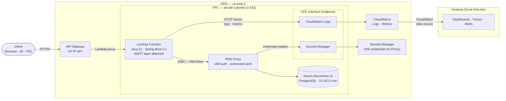
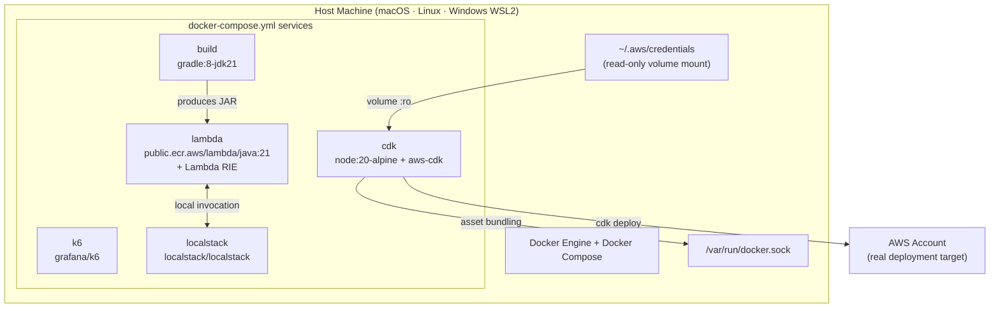
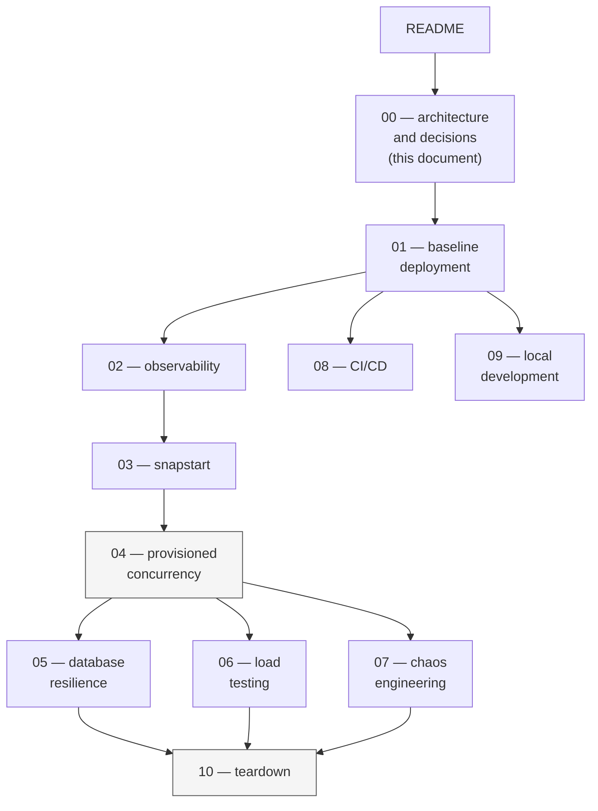

_Lambda Resilience Atelier — Architecture Decision Record_ _ADR-0001 · Version 2.0 — April 2026_

---

## Status

Accepted — April 2026

**Format:** MADR (Markdown Architectural Decision Records)

---

## Context and Problem Statement

This document governs the architectural decisions for the Lambda Resilience Atelier — a public, modular codelab that makes cold start anatomy, concurrent initialization pressure, connection exhaustion, and chaos behavior observable through hands-on experiments on AWS.

The codelab must satisfy four constraints simultaneously:

1. **Didactic fidelity** — the experiments must make cold start anatomy, concurrent initialization pressure, connection exhaustion, and chaos behavior visible as observable phenomena in a dashboard, not just asserted in prose.
2. **Public accessibility** — any AWS practitioner must be able to run the codelab from a clean machine. Toolchain friction is a first-class failure mode.
3. **Cost discipline** — resources must be destroyable after each module. No module leaves orphaned resources. Total cost across all modules must be under $5.
4. **Production relevance** — the architecture must reflect decisions a practitioner would actually face in a real Java Lambda workload, not a contrived example.

These four constraints are in tension. A maximally didactic example (large Java framework, complex infrastructure) conflicts with cost discipline. Maximum accessibility conflicts with production-shaped complexity. Each decision below documents how that tension was resolved.

---

## System Architecture



---

## Local Development Architecture



---

## Decisions

---

### Decision 1: Runtime and Application Framework

**Context:** The codelab's central experiments are cold start measurement, SnapStart, and Provisioned Concurrency. The observable value of these experiments depends entirely on the magnitude of the cold start delta. A runtime with a small cold start makes the experiments technically correct but visually unimpressive and less representative of the Java workloads where these decisions most frequently arise in production.

**Considered options:**

| Option | Cold start (isolated) | Cold start (burst) | Notes |
|---|---|---|---|
| Java 21 + Spring Boot 3.x | 1.3–2.2s | 2.5–3.5s | Largest delta; most production-relevant Java baseline |
| Java 21 + Quarkus (native) | 50–200ms | 100–400ms | GraalVM native image eliminates JVM startup; SnapStart irrelevant |
| Java 21 + plain handler (no framework) | 400–800ms | 800–1,500ms | Smaller delta; less representative of real workloads |
| Python 3.12 | 100–400ms | 200–600ms | Small delta; SnapStart not available |
| Go 1.22 | 50–200ms | 100–300ms | Smallest delta; SnapStart not available |
| Node.js 20 | 100–350ms | 200–500ms | Small delta; SnapStart not available |

**Decision:** Java 21 + Spring Boot 3.x.

**Trade-offs:**

- **Good:** The cold start delta (1.3–3.5s) is large enough to be directly visible in a Grafana dashboard without instrumentation tricks. The SnapStart and Provisioned Concurrency experiments produce dramatic, unambiguous before/after comparisons.
- **Good:** Spring Boot is the most common Java framework in production, making the baseline directly relevant to what practitioners encounter.
- **Good:** Spring's context initialization (300–700ms of the baseline) is the primary target for SnapStart's checkpoint-and-restore mechanism — the experiment demonstrates exactly what SnapStart is designed to address.
- **Bad:** Highest idle cold start of any option. A practitioner running a latency-sensitive Go or Python workload may find the absolute numbers less directly applicable.
- **Rejected — Quarkus native:** GraalVM native compilation produces a binary that starts in milliseconds. SnapStart becomes irrelevant; Provisioned Concurrency becomes a cost decision rather than a correctness decision. The experiment loses its didactic purpose.

---

### Decision 2: Build Tool

**Context:** The build tool must integrate seamlessly with Spring Boot, support Lambda fat JAR packaging, and impose zero setup friction on the reader.

**Considered options:**

| Option | Spring Boot support | Lambda packaging | Reader friction |
|---|---|---|---|
| Gradle 8.x | First-class (Spring Initializr default) | `shadowJar` — two lines | Zero (Gradle Wrapper bundled) |
| Maven 3.x | First-class | `maven-shade-plugin` — verbose POM | Requires Maven installed on host |
| Bazel | Community-maintained (`rules_jvm_external`) | Custom rules required | Very high — BUILD files, WORKSPACE, steep learning curve |

**Decision:** Gradle 8.x, running in a `gradle:8-jdk21` Docker container.

**Trade-offs:**

- **Good:** Gradle Wrapper (`gradlew`) is committed to each module. The reader does not install Gradle or Java on the host — the container handles it.
- **Good:** Spring Initializr generates Gradle projects by default. The `org.springframework.boot` Gradle plugin handles packaging, dependency management, and bootJar production natively.
- **Bad:** Gradle's incremental build cache is not preserved between container invocations by default — first build per session is always a full build. Mitigated by mounting a Gradle cache volume in `docker-compose.yml`.
- **Rejected — Bazel:** Designed for large hermetic monorepos (Google, Uber, Twitter) where distributed caching across thousands of targets justifies the overhead. Adds BUILD files, WORKSPACE configuration, and custom Lambda packaging rules with no benefit at the scope of this codelab. Spring Boot and Lambda packaging support in Bazel is community-maintained, not first-class.

**Shadow packaging — non-obvious requirements for Spring Boot + aws-serverless-java-container:**

Lambda requires a single flat fat JAR, not Spring Boot's nested-JAR loader format, so we use `com.gradleup.shadow:8.3.0` instead of `spring-boot-maven-plugin` / `bootJar`. Shadow's default merge strategies silently drop entries that Spring Boot and `aws-serverless-java-container-springboot3` depend on. Three transformations are mandatory:

1. **`mergeServiceFiles()`** — for `META-INF/services/*` (ServiceLoader SPI).
2. **`PropertiesFileTransformer` with `mergeStrategy = "append"` for `META-INF/spring.factories`** — without this, the default last-one-wins merge drops Spring Boot's `org.springframework.boot.ApplicationContextFactory` entry (the one that maps `WebApplicationType.SERVLET` to `AnnotationConfigServletWebServerApplicationContext`). The symptom is a cryptic `ClassCastException` at `SpringBootLambdaContainerHandler.initialize:200` — Spring Boot falls back to a non-web context because no factory is registered for SERVLET. See [GradleUp/shadow#899](https://github.com/GradleUp/shadow/issues/899), [aws/serverless-java-container#904](https://github.com/aws/serverless-java-container/issues/904).
3. **Explicit `append(...)` for every Spring Boot `META-INF/spring/*.imports`** — Spring Boot autoconfiguration discovery reads these files; a merge that drops entries causes specific autoconfigurations to silently not run. When bumping Spring Boot, verify the append list against the new `spring-boot-autoconfigure` JAR.

A belt-and-suspenders mitigation that sidesteps Spring Boot's classpath probe entirely is to set `spring.main.web-application-type=servlet` in `api/src/main/resources/application.properties`. This is committed in the baseline module alongside the Shadow transformations; removing either is unsafe.

---

### Decision 3: Infrastructure Tool

**Context:** The infrastructure tool must express the Lambda + VPC + Aurora + RDS Proxy + Application Auto Scaling architecture, deploy to AWS, and be written in a language the Java reader already knows.

**Considered options:**

| Option | Language | Lambda constructs | Teardown | Reader context switch |
|---|---|---|---|---|
| AWS CDK v2 (Java) | Java | First-class (`Function`, `Version`, `Alias`, `DatabaseProxy`) | `cdk destroy` | None — same language |
| Terraform | HCL | Supported (`aws_lambda_function`, `aws_rds_cluster`) | `terraform destroy` | High — new language and toolchain |
| AWS SAM | YAML | First-class for Lambda | `sam delete` | Medium — YAML-only, limited for complex infra |
| AWS CDK v2 (TypeScript) | TypeScript | First-class | `cdk destroy` | Medium — second language |

**Decision:** AWS CDK v2 (Java), running in a `node:20-alpine` container with `aws-cdk` installed.

**Trade-offs:**

- **Good:** Application and infrastructure code are in the same language. The reader's mental model does not context-switch between a Java Lambda handler and a TypeScript or HCL infrastructure definition.
- **Good:** CDK's Lambda constructs handle asset bundling (running Gradle inside Docker to produce the deployment ZIP), layer attachment, VPC wiring, and IAM role generation. The infrastructure code expresses intent, not mechanics.
- **Good:** `cdk destroy` reliably removes all CDK-managed resources in dependency order, satisfying the teardown requirement.
- **Bad:** CDK requires Node.js even for Java applications. The `cdk` container (node:20-alpine) must mount the host Docker socket (`/var/run/docker.sock`) because CDK uses Docker internally to bundle Lambda assets — granting the container access to the host daemon.
- **Bad:** CDK CloudFormation deployments are slower than Terraform plan/apply cycles for iterative development. For a codelab with infrequent deployments, this is acceptable.
- **Rejected — Terraform:** Correct choice for multi-cloud or cross-provider infrastructure teams. For an AWS-only, Lambda-specific codelab targeting Java practitioners, the HCL context switch reduces the signal-to-noise ratio.

---

### Decision 4: Local Toolchain Environment

**Context:** A public codelab audience spans macOS, Linux, and Windows. Requiring Java 21, Node.js 20, CDK CLI, k6, and Gradle to be installed on the host produces a different setup experience on every OS and every existing toolchain configuration. Toolchain setup is the most common reason practitioners abandon codelabs before completing Module 01.

**Considered options:**

| Option | Host requirement | Version consistency | OS portability |
|---|---|---|---|
| Host installs (Java, Node.js, CDK, k6) | All tools installed on host | Poor — depends on host state | Poor — different per OS |
| Docker + Docker Compose | Docker only | Exact — pinned by image tag | Excellent — same on all platforms |
| Dev Containers (VS Code) | Docker + VS Code | Exact | Good — requires VS Code |
| Nix flake | Nix package manager | Exact | Good — Nix required |

**Decision:** Docker + Docker Compose. Nothing runs on the host except Docker.

**Trade-offs:**

- **Good:** Single prerequisite. Any reader who can run `docker info` can run the codelab.
- **Good:** Image tags pin exact versions of every tool. The codelab is reproducible regardless of when it is run.
- **Good:** The dev loop — `docker compose run --rm build && docker compose up lambda` — is identical on all platforms.
- **Bad:** CDK requires the host Docker socket mounted into the `cdk` container (`/var/run/docker.sock`) because CDK uses Docker internally to bundle Lambda assets. This grants the container access to the host daemon. It is a standard CDK-in-Docker pattern and is documented explicitly — it is a deliberate, understood trade-off, not a hidden one.
- **Bad:** Gradle's build cache and CDK's asset cache are not persisted across `docker compose run --rm` invocations by default. Named volumes in `docker-compose.yml` mitigate this.
- **Rejected — Dev Containers:** Ties the codelab to VS Code. A public audience includes practitioners who use IntelliJ, Neovim, or the terminal directly.

---

### Decision 5: API Gateway Type

**Context:** Lambda requires a trigger. The codelab needs an HTTP endpoint that routes requests to the Lambda function with minimal configuration overhead.

**Considered options:**

| Option | Cost (us-east-1) | Added latency | Notable capabilities absent |
|---|---|---|---|
| HTTP API | $1.00 / million requests | ~5–10ms | WAF integration, request caching, usage plans, resource policies |
| REST API | $3.50 / million requests | ~15–29ms | — |

**Decision:** API Gateway HTTP API.

**Trade-offs:**

- **Good:** 70% cheaper than REST API at equivalent request volumes.
- **Good:** 3× lower latency overhead — more accurate cold start measurement in Module 01.
- **Bad:** HTTP API uses payload format v2.0 by default, which differs structurally from the REST API proxy event format. The Spring Boot Lambda handler must be configured for the v2.0 format. This is documented in Module 01.
- **Acceptable:** The absent REST API features (WAF, caching, usage plans) are not relevant to the codelab's experiments.

---

### Decision 6: VPC Networking — Interface Endpoints vs NAT Gateway

**Context:** The Lambda function is deployed in private VPC subnets and must reach AWS services. In the baseline module (Module 01) it only needs CloudWatch Logs (telemetry); once Module 05 introduces RDS Proxy, Secrets Manager is added (for proxy credential rotation) and RDS Proxy itself (for the database connection). Private subnets have no internet route by default. Two patterns exist for reaching AWS services from a private subnet.

**Considered options:**

| Option | Cost (2 AZs) | Security | Complexity |
|---|---|---|---|
| NAT Gateway | $0.09/hr ($0.045 × 2 AZs) | Internet path from compute | Simple — single resource |
| VPC Interface Endpoints (PrivateLink) | Scales with endpoint count — $0.01 × endpoints × AZs per hour | No internet path | One endpoint resource + security group rules per service |

**Decision:** VPC Interface Endpoints. Endpoints are introduced per-module as services are added:
- **Module 01 (baseline):** CloudWatch Logs endpoint only — **$0.02/hr** (1 endpoint × 2 AZs × $0.01).
- **Module 05 (RDS Proxy):** Secrets Manager endpoint added — **$0.04/hr** (2 endpoints × 2 AZs × $0.01). RDS Proxy endpoint is provisioned automatically by AWS when the proxy is created; it is not an interface VPC endpoint.

**Trade-offs:**

- **Good:** No internet path from the Lambda function — smaller attack surface.
- **Good:** Cheaper than a NAT Gateway at this codelab's scale — 78% cheaper in Module 01 ($0.02/hr vs $0.09/hr), 55% cheaper once Secrets Manager is added in Module 05 ($0.04/hr vs $0.09/hr).
- **Good:** Standard AWS SDK endpoint URLs resolve to private IPs automatically when private DNS is enabled on the endpoints — no code changes required.
- **Bad:** Two additional CDK resources (interface endpoints + security group rules). The CDK stack is slightly more complex than a NAT Gateway approach.
- **Key finding from research:** Lambda functions in VPC no longer incur a cold start penalty from VPC networking. Since September 2019, Lambda uses Hyperplane ENIs — managed network resources created at function configuration time (not at invocation time), shared per VPC + subnet + security group combination. The VPC cold start overhead that existed before this change (10+ seconds) is eliminated. See the AWS Compute Blog post ["Announcing improved VPC networking for AWS Lambda functions"](https://aws.amazon.com/blogs/compute/announcing-improved-vpc-networking-for-aws-lambda-functions/) for the full architecture.

---

### Decision 7: Lambda → Database Authentication

**Context:** The Lambda function must authenticate to the database. Three patterns exist. The correct choice affects security posture, operational complexity, and the educational value of the module.

**Pattern lineage:** IAM database authentication for RDS descends from the EC2 instance profile pattern (2012) — the principle that AWS compute should use the AWS identity plane rather than managing static passwords. EC2 instances use their attached IAM role to call AWS APIs with no stored access keys. Lambda execution roles apply the same principle. In 2017, AWS extended this to RDS: instead of a password, the database accepts a SigV4-signed authentication token generated from any IAM principal. The token is generated locally from the execution role's temporary credentials — no network call to STS is required.

**The two-hop architecture with RDS Proxy:**

When RDS Proxy is in the path, there are two distinct authentication hops:

```
Hop 1: Lambda → RDS Proxy
  Lambda execution role → rds-db:connect permission
  AWS SDK generates SigV4 token (15-min TTL, no STS call)
  Proxy validates token against IAM
  Lambda never holds a database password

Hop 2: RDS Proxy → Aurora (transparent to Lambda)
  Proxy retrieves credentials from Secrets Manager
  Proxy opens a pooled connection to Aurora using username/password
  Secrets Manager handles automatic credential rotation
```

Lambda is entirely decoupled from the actual database password. The Secrets Manager pattern the practitioner already knows is what runs in Hop 2 — the proxy handles it.

**Considered options:**

| Option | Lambda holds password? | Rotation | Code complexity | IAM audit trail |
|---|---|---|---|---|
| IAM auth token via RDS Proxy | No | Automatic (Secrets Manager in Proxy) | Medium — token generation + SSL required | Yes — CloudTrail logs IAM auth calls |
| Secrets Manager direct (Lambda → Secrets Manager → RDS) | Yes (transiently) | Manual refresh or Lambda-side logic | Low — familiar pattern | Partial |
| Password in environment variable | Yes (permanently) | Manual — requires redeployment | Minimal | No |

**Decision:** IAM authentication to RDS Proxy (`rds-db:connect` on the proxy resource ARN).

**Trade-offs:**

- **Good:** Lambda never stores or transmits a database password. The execution role IS the credential.
- **Good:** Token is ephemeral (15-minute TTL), tied to the IAM identity, and rotated automatically.
- **Good:** AWS CloudTrail records every IAM authentication — full audit trail of which Lambda function connected to which proxy, and when.
- **Good:** The Secrets Manager pattern the practitioner already knows is preserved at Hop 2 (proxy → Aurora), not discarded. The two-hop architecture is an extension of, not a replacement for, that knowledge.
- **Bad:** Requires SSL/TLS on the JDBC connection (mandatory for IAM auth) — one additional configuration property in the Spring Boot datasource.
- **Bad:** IAM token generation adds ~1–2ms per new connection. Mitigated by connection pooling in RDS Proxy — tokens are reused for the lifetime of a pooled connection.
- **Bad:** IAM auth has a limit of approximately 200 new authentication connections per second across all requestors. At this codelab's scale (10–500 concurrent Lambda invocations), this limit is not approached. In high-scale production, RDS Proxy's connection pooling reduces IAM auth calls to near-zero by reusing established connections.
- **Rejected — password in environment variable:** Environment variables are visible in the Lambda console, in CloudTrail, and in any tooling that reads function configuration. This is explicitly called out as an antipattern in the AWS Well-Architected Security Pillar.

---

### Decision 8: Observability Stack

**Context:** The codelab's experiments require a dashboard that makes cold start duration, concurrent invocation count, and request latency visible in real time. The observability stack must be zero-infrastructure (no additional servers to deploy) and fit within a free tier.

**Considered options:**

| Option                     | Infrastructure required           | Free tier                       | Cold start visibility                              |
| -------------------------- | --------------------------------- | ------------------------------- | -------------------------------------------------- |
| ADOT layer + Grafana Cloud | None (managed layer + SaaS)       | Yes — 10k series, 50GB, 14 days | Yes — Init Duration metric, trace spans            |
| AWS X-Ray only             | None                              | Yes (limited)                   | Partial — traces only, no custom metrics dashboard |
| CloudWatch only            | None                              | Partial (limited free tier)     | Yes — but dashboard UX is limited                  |
| Datadog                    | Datadog agent or Forwarder Lambda | No free tier                    | Yes — excellent                                    |
| Grafana OSS (self-hosted)  | EC2 or ECS for Grafana server     | No (EC2/ECS cost)               | Yes                                                |

**Decision:** ADOT Lambda managed layer + Grafana Cloud free tier.

**Trade-offs:**

- **Good:** The ADOT layer is attached to the function as a Lambda layer — no sidecars, no additional compute. Activated via `AWS_LAMBDA_EXEC_WRAPPER=/opt/otel-handler`.
- **Good:** Grafana Cloud free tier (10,000 metric series, 50GB logs/traces/month, 14-day retention, OTLP ingest included) is sufficient for all codelab experiments.
- **Good:** OpenTelemetry is the emerging standard for cloud-native observability — using it in the codelab teaches a transferable skill, not a proprietary one.
- **Bad:** Grafana Cloud free tier limits mean the codelab cannot be left running indefinitely. Within a 2–4 hour session, consumption is well under the limits.
- **Rejected — X-Ray only:** X-Ray provides traces but not the metrics dashboard (Init Duration over time, ConcurrentExecutions) that makes the burst cold start cluster visible as a distinct visual phenomenon.

---

### Decision 9: Load Testing Tool

**Context:** Module 06's experiment requires reproducing concurrent initialization pressure — a burst of traffic that forces Lambda to cold-start many instances simultaneously. The tool must be able to produce a steep ramp from 0 to 500 virtual users in under 10 seconds and sustain the load long enough for the steady-state warm pattern to emerge.

**Considered options:**

| Option | Ramp shape control | Container image | k6 compatibility |
|---|---|---|---|
| k6 | `stages` API — exact control | `grafana/k6` (official) | Native |
| JMeter | Thread group ramp-up — gradual by default | Available but heavyweight | Via plugin |
| Locust | `spawn_rate` — gradual, not step | Available | — |
| Artillery | `phases` — similar to k6 | Available | — |

**Decision:** k6, running in the `grafana/k6` container.

**Trade-offs:**

- **Good:** The `stages` API defines the ramp profile precisely: `{ duration: '10s', target: 500 }` produces a vertical ramp that concentrates cold starts into a 10-second window, making the burst pattern unambiguous in the dashboard.
- **Good:** k6 scripts are JavaScript — readable by any practitioner regardless of Java background.
- **Good:** Official Docker image (`grafana/k6`) is maintained by Grafana Labs and integrates natively with the Grafana Cloud output plugin.
- **Bad:** k6 v1.0 (the current major version) introduced TypeScript support natively — the codelab uses JavaScript for simplicity, but practitioners should be aware TypeScript is now available without a transpilation step.
- **Rejected — JMeter:** JMeter's GUI-oriented workflow and XML configuration are poorly suited to a codelab format. The default thread group ramp is gradual, not step-shaped.

---

### Decision 10: Chaos Engineering Tool

**Context:** Module 07 requires injecting failure conditions into the running Lambda workload in a controlled, self-limiting way. The tool must support Lambda-specific failure modes and terminate automatically if the blast radius exceeds a threshold.

**Considered options:**

| Option | Managed | Lambda-specific actions | Stop conditions | Setup required |
|---|---|---|---|---|
| AWS Fault Injection Service (FIS) | Yes | `invocation-add-delay`, `invocation-error` (GA Oct 2024) | CloudWatch alarm-based | IAM roles + experiment template |
| Chaos Monkey (Netflix) | No | Not Lambda-native | Manual | EC2 or ECS deployment |
| Gremlin | No (SaaS) | Lambda supported | Yes | Agent or API key |

**Decision:** AWS Fault Injection Service (FIS).

**Important correction from initial planning:** FIS does not have a native Lambda throttle action. The three available `aws:lambda:function` actions are `invocation-add-delay`, `invocation-error`, and `invocation-http-integration-response`. Lambda throttle simulation (Module 07 bonus experiment) requires setting reserved concurrency to 0 via a separate API call — it is not a FIS action.

**Trade-offs:**

- **Good:** Fully managed — no additional infrastructure. FIS experiment templates are CDK constructs (`CfnExperimentTemplate`).
- **Good:** CloudWatch alarm-based stop conditions self-terminate the experiment if error rate exceeds the defined threshold. The blast radius is bounded by design.
- **Good:** `invocation-add-delay` directly simulates the latency injection scenario relevant to the codelab (downstream dependency slowdown).
- **Bad:** No native throttle action — the throttle experiment requires a separate reserved concurrency operation. This is documented explicitly in Module 07.
- **Rejected — Gremlin:** Requires a paid subscription for Lambda support. Not suitable for a public codelab with a free-tier constraint.

---

## Module Dependency Map



---

## Cost Model

All estimates use `us-east-1` pricing. Session cost assumes a 2–4 hour working session with `cdk destroy` executed at the end.

### Per-session estimates

| Module | Resources | Hourly rate | 4-hour session |
|---|---|---|---|
| 01 — Baseline | Lambda + API Gateway + CloudWatch Logs endpoint (×2 AZs) | ~$0.02/hr | ~$0.08 |
| 02 — Observability | ADOT layer (free) · Grafana Cloud free tier | $0.00 | $0.00 |
| 03 — SnapStart | Same as Module 01 | ~$0.02/hr | ~$0.08 |
| 04 — Provisioned Concurrency | Lambda PC (512MB × 10) + Module 01 resources | ~$0.11/hr | **~$0.44** |
| 05 — Database | Aurora 0.5 ACU + RDS Proxy (8 ACU min) + VPC endpoints | ~$0.20/hr | **~$0.80** |
| 06 — Load Testing | Module 04 resources + burst invocations | ~$0.15/hr | ~$0.60 |
| 07 — Chaos | Module 04 resources + FIS invocations | ~$0.13/hr | ~$0.52 |
| 08 — CI/CD | GitHub Actions only | $0.00 | $0.00 |
| 09 — Local Dev | No AWS resources | $0.00 | $0.00 |
| 10 — Teardown | — | $0.00 | $0.00 |

**Total across all modules (separate sessions): ~$2.50–$3.50**

### Cost formulas

**Provisioned Concurrency (x86, us-east-1):**
```
Cost = memory_GB × concurrent_count × duration_seconds × $0.0000041667
Example: 0.5 GB × 10 concurrent × 3600s/hr = $0.075/hr
Lambda free tier does not apply to Provisioned Concurrency.
```

**Aurora Serverless v2:**
```
Cost = ACU_count × $0.12/ACU-hr
At 0.5 ACU minimum = $0.06/hr
When RDS Proxy is attached: auto-pause is disabled — 0.5 ACU is always-on.
```

**RDS Proxy:**
```
Minimum charge: 8 ACU-hours per hour regardless of Aurora cluster size
Cost = max(actual_ACU, 8) × $0.015/ACU-hr
Minimum cost = 8 × $0.015 = $0.12/hr
```

**VPC Interface Endpoints:**
```
Cost = endpoint_count × AZ_count × $0.01/hr
Module 01 baseline:   1 endpoint  × 2 AZs × $0.01 = $0.02/hr
Module 05 onward:     2 endpoints × 2 AZs × $0.01 = $0.04/hr
Compare: NAT Gateway = 2 AZs × $0.045/hr = $0.09/hr (constant regardless of services used)
```

### Teardown order

Always destroy in this sequence to stop billing as early as possible:

1. Disable Application Auto Scaling target (Module 04)
2. Set Provisioned Concurrency to 0 on the function alias (Module 04)
3. `cdk destroy` Module 05 (Aurora + RDS Proxy — longest deletion, ~15 min)
4. `cdk destroy` Modules 04 → 03 → 02 → 01 in order
5. Delete CloudWatch log groups manually (CDK does not delete them by default)

---

## References

| Source | Publisher | URL |
|---|---|---|
| Amazon API Gateway Pricing | AWS | https://aws.amazon.com/api-gateway/pricing/ |
| Announcing improved VPC networking for AWS Lambda functions | AWS Compute Blog | https://aws.amazon.com/blogs/compute/announcing-improved-vpc-networking-for-aws-lambda-functions/ |
| Lambda VPC configuration | AWS Documentation | https://docs.aws.amazon.com/lambda/latest/dg/configuration-vpc.html |
| Using CloudWatch Logs with interface VPC endpoints | AWS Documentation | https://docs.aws.amazon.com/AmazonCloudWatch/latest/logs/cloudwatch-logs-and-interface-VPC.html |
| Using an AWS Secrets Manager VPC endpoint | AWS Documentation | https://docs.aws.amazon.com/secretsmanager/latest/userguide/vpc-endpoint-overview.html |
| Configuring IAM authentication for RDS Proxy | AWS Documentation | https://docs.aws.amazon.com/AmazonRDS/latest/UserGuide/rds-proxy-iam-setup.html |
| IAM role-based authentication to Amazon Aurora from serverless applications | AWS Database Blog | https://aws.amazon.com/blogs/database/iam-role-based-authentication-to-amazon-aurora-from-serverless-applications/ |
| IAM database authentication for RDS | AWS Documentation | https://docs.aws.amazon.com/AmazonRDS/latest/UserGuide/UsingWithRDS.IAMDBAuth.html |
| Using Amazon RDS Proxy with AWS Lambda | AWS Compute Blog | https://aws.amazon.com/blogs/compute/using-amazon-rds-proxy-with-aws-lambda/ |
| Scaling to zero ACUs with Aurora Serverless v2 | AWS Documentation | https://docs.aws.amazon.com/AmazonRDS/latest/AuroraUserGuide/aurora-serverless-v2-auto-pause.html |
| Amazon Aurora Serverless v2 supports scaling to zero capacity | AWS What's New | https://aws.amazon.com/about-aws/whats-new/2024/11/amazon-aurora-serverless-v2-scaling-zero-capacity/ |
| Amazon Aurora Pricing | AWS | https://aws.amazon.com/rds/aurora/pricing/ |
| Amazon RDS Proxy Pricing | AWS | https://aws.amazon.com/rds/proxy/pricing/ |
| AWS Lambda Pricing | AWS | https://aws.amazon.com/lambda/pricing/ |
| ADOT Lambda Java Auto-Instrumentation | AWS Open Source | https://aws-otel.github.io/docs/getting-started/lambda/lambda-java-auto-instr/ |
| AWS Lambda FIS actions (GA October 2024) | AWS What's New | https://aws.amazon.com/about-aws/whats-new/2024/10/aws-lambda-fault-injection-service-actions/ |
| AWS Lambda FIS actions reference | AWS Documentation | https://docs.aws.amazon.com/fis/latest/userguide/use-lambda-actions.html |
| Performance and scaling for Aurora Serverless v2 | AWS Documentation | https://docs.aws.amazon.com/AmazonRDS/latest/AuroraUserGuide/aurora-serverless-v2.setting-capacity.html |
| MADR — Markdown Architectural Decision Records | adr.github.io | https://adr.github.io/madr/ |

---

## Changelog

| Version | Date | Changes |
|---|---|---|
| v1.0 | April 2026 | Initial document. System architecture diagram, local development architecture, tech stack decisions with rationale, module dependency map, and annotated cost model. |
| v2.0 | April 2026 | Restructured as ADR (MADR format). Each decision now has explicit context, considered options table, trade-offs, and rejected alternatives with rationale. Added Decision 7 (Lambda → database authentication) with full two-hop RDS Proxy mechanism, IAM token lineage from EC2 instance profiles, and Secrets Manager pattern relationship. Adopted MADR format. |
| v2.1 | April 2026 | Reconciled Decision 6 VPC endpoint cost model: Module 01 baseline deploys only the CloudWatch Logs endpoint ($0.02/hr), with Secrets Manager added in Module 05 ($0.04/hr). Per-session cost table updated accordingly for Modules 01 and 03. No decision reversed. |
| v2.2 | April 2026 | Added "Shadow packaging — non-obvious requirements" section to Decision 2, documenting the mandatory `PropertiesFileTransformer` for `META-INF/spring.factories` and the `application.properties` web-application-type override. Captured during Module 01 debugging to prevent repeating the same failure in Modules 03+. No decision reversed. |
