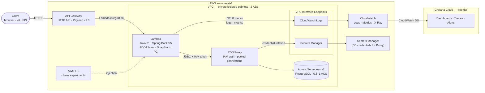
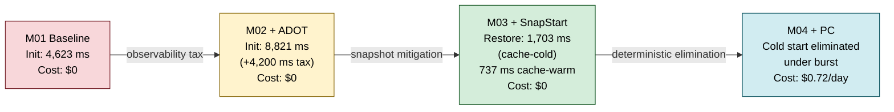
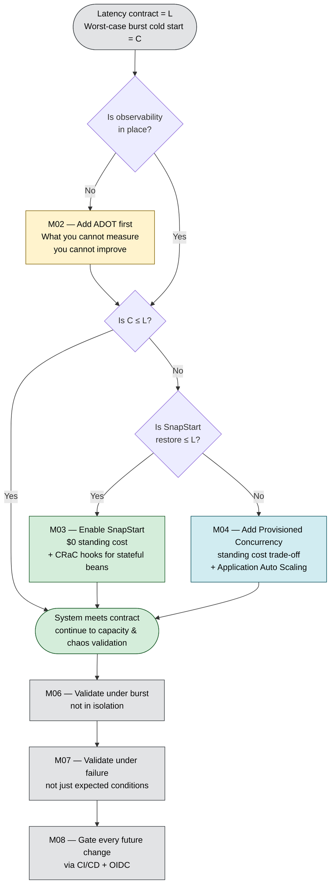

_Lambda Resilience Atelier — Architecture, Decisions, and Findings_ _ADR-0001 · Version 3.0 — May 2026_

---

## Status

**Final — May 2026.** The codelab is complete through Module 08 (CI/CD). Modules 09 (local development) and 10 (consolidated teardown) were dropped from v1.0 scope: Lambda RIE does not reproduce Firecracker cold start and therefore contributes nothing to the thesis, and per-module teardown sections make a consolidated teardown document redundant.

This document supersedes ADR-0001 v2.0, which captured prospective decisions only. v3.0 retains the decisions in compact form and adds the empirical findings, the per-module measurements, and a synthesis of the cross-cutting takeaways.

---

## Thesis

**Cold starts are a fail-slow failure mode for Java Lambdas** — slow but recoverable, visible to users at the moment of greatest demand, and addressable through a deliberate stack of mitigations whose cost-versus-effect curve must be measured rather than assumed.

The atelier tested this thesis empirically across eight modules: M01 establishes the baseline; M02–M04 build the mitigation hierarchy (observability → SnapStart → Provisioned Concurrency); M05 covers the parallel concurrency failure mode (database connection exhaustion); M06–M07 verify the system holds under burst load and deliberate failure injection; M08 gates every future change operationally. The findings below are the receipts.

---

## Context

The codelab was scoped to satisfy four constraints that are in tension:

1. **Didactic fidelity** — the experiments must make cold start anatomy, concurrent initialization pressure, connection exhaustion, and chaos behavior visible as observable phenomena in a dashboard, not just asserted in prose.
2. **Public accessibility** — any AWS practitioner must be able to run the codelab from a clean machine. Toolchain friction is a first-class failure mode.
3. **Cost discipline** — resources must be destroyable after each module. Total cost across all modules must stay under $5.
4. **Production relevance** — the architecture must reflect decisions a practitioner would actually face in a real Java Lambda workload, not a contrived example.

Each decision below documents how a specific tension was resolved. Each finding documents what the resolution actually delivered when run against real AWS infrastructure.

---

## System Architecture

The deployed system is the *union* of all eight modules. Each module composes additively onto the previous: M01 establishes Lambda + VPC + API Gateway; M02 attaches the ADOT layer; M03 enables SnapStart; M04 attaches Provisioned Concurrency; M05 adds RDS Proxy + Aurora; M06–M07 are observation regimes (no infrastructure); M08 wires CI/CD. Modules can be deployed and torn down independently — the CDK app exposes one stack per module.

---

## Decisions

The full prospective rationale (Context · Considered Options · Trade-offs · Rejected) lives in the companion atelier's `00-architecture-and-decisions.md`. The compact summary below pairs each decision with its principal rejected alternative and — where the consequence only emerged during implementation — a post-hoc note flagging the cost.

| # | Decision | Choice | Principal rejected alternative | Post-hoc consequence |
|---|---|---|---|---|
| 1 | Runtime + framework | Java 21 + Spring Boot 3.5 | Quarkus native (eliminates SnapStart's didactic value) | M01 cold start landed at 4.6 s vs. predicted 1.3–2.2 s; root cause: `spring-cloud-function-serverless-web` transitive deps from `aws-serverless-java-container-springboot3:2.1.5` |
| 2 | Build tool | Gradle 8 + `com.gradleup.shadow:8.3.0` | Bazel (scope mismatch); Maven (host install) | Three Shadow transformations are mandatory: `mergeServiceFiles()`, `PropertiesFileTransformer` on `spring.factories`, `append()` on `spring/*.imports` |
| 3 | Infra-as-code | AWS CDK v2 (Java) — CLI `2.1118.2`, lib `2.250.0` | Terraform (HCL context switch); SAM (YAML-only ceiling) | CDK CLI requires Node.js; container needs `/var/run/docker.sock` mount for asset bundling |
| 4 | Local toolchain | Docker + Compose only on host | Dev Containers (VS Code lock-in); Nix (package-manager prereq) | — |
| 5 | API Gateway type | HTTP API + Payload v1.0 | REST API ($3.50 vs $1.00 per M req) | Payload v2.0 does not work reliably with `getAwsProxyHandler` — pet-store canonical uses v1.0 |
| 6 | VPC egress | Interface Endpoints (Logs in M01; + Secrets Manager in M05) | NAT Gateway ($0.09/hr vs $0.02–0.04/hr) | Lambda-in-VPC has zero cold-start penalty since 2019 (Hyperplane ENIs) — VPC choice is purely a cost question, not a latency one |
| 7 | DB authentication | IAM token via RDS Proxy (two-hop) | Secrets Manager direct; password in env var | IAM tokens have a 15-min TTL; SnapStart freezes them in the snapshot — the token MUST be refreshed per pool borrow, not at init |
| 8 | Observability | ADOT Lambda layer + Grafana Cloud free tier | X-Ray-only (no metric dashboard); CloudWatch-only (UX) | **ADOT exec wrapper (`/opt/otel-handler`) is mutually exclusive with FIS's chaos wrapper (`/opt/aws-fis-bootstrap`).** Lambda honors one wrapper per function. Chaos experiments require a parallel non-ADOT stack — doubling infrastructure cost during chaos validation and forfeiting distributed traces on the chaos function. Not advertised in either service's docs. |
| 9 | Load testing | k6 with `stages` API | JMeter (gradual ramp, GUI workflow); Locust (gradual `spawn_rate`) | — |
| 10 | Chaos engineering | AWS FIS Lambda actions (`invocation-add-delay`, `invocation-error`) | Custom throttle (FIS has no native Lambda throttle action) | FIS Lambda extension is NOT auto-injected; functions need deploy-time prerequisites (FIS layer + 2 env vars + S3 bucket + IAM grants on both function and FIS roles) — the parallel `LraChaosStack` exists to satisfy these prerequisites without disturbing the canonical PC stack |
| 11 | CI/CD | GitHub Actions + OIDC (no long-lived AWS keys) | IAM user + access keys (rotation theater) | — |

---

## Empirical Findings

Cold-start budget across modules. Numbers below are direct measurements from `us-east-1`, not estimates.

| Module | Configuration | Init Duration (cold) | Restore Duration | Warm Duration | Memory | Standing cost |
|---|---|---|---|---|---|---|
| **01 Baseline** | Java 21 + Spring Boot 3.5 + VPC | **4,623 ms** | — | ≈ 5 ms | 182 MB | $0 |
| **02 Observability** | + ADOT Java agent layer | **8,821 ms avg** (+4,200 ms) | — | 580–620 ms (+575 ms) | 313 MB (+131 MB) | $0 |
| **03 SnapStart** | + SnapStart + Spring CRaC checkpoint | 12,744–13,344 ms one-time at publish | **737 ms cache-warm · 1,703 ms cache-cold first restore** | 26–27 ms | 313 MB | $0 |
| **04 Provisioned Concurrency** | + 2 PC × 1024 MB + ASG | Cold start eliminated under burst | — | ≈ 5 ms | 313 MB | **$0.72/day** |
| **05 Database Resilience** | + Aurora Serverless v2 + RDS Proxy + IAM auth | (unchanged from M04) | (unchanged from M04) | — | — | + Aurora ACU + Proxy 8-ACU min + Secrets Manager VPC endpoint ≈ $1.20/day idle |
| **06 Load Testing** | M04 stack + 0→500 VU burst-ramp × 80 s | 342,872 invocations · throughput **4,283 req/s** | — | **p(95) = 110 ms · max = 24,690 ms** | — | + ≈ $0.40–0.50 per burst |
| **07 Chaos** | parallel `LraChaosStack` (no ADOT) + FIS templates | (unchanged from M04 baseline) | — | depends on injection action | — | + FIS $0.10/action-min + duplicated stack |
| **08 CI/CD** | GitHub Actions + OIDC, no long-lived creds | — | — | — | — | $0 |

### Cold-start budget reduction

### Per-module commentary

- **M01 — Baseline.** Java 21 + Spring Boot 3.5 cold start landed at 4,623 ms, more than double the upfront prediction (1.3–2.2 s). Root cause: `spring-cloud-function-serverless-web` transitive dependencies from `aws-serverless-java-container-springboot3:2.1.5` produce more beans than the prediction assumed. Lesson: production Java Lambda cold-start estimates *must* be measured; framework version drift dominates over JVM version drift.
- **M02 — Observability has a price.** Attaching the ADOT Java agent layer added ≈ 4,200 ms to cold start (4.6 s → 8.8 s) and almost doubled memory (182 MB → 313 MB at 1024 MB allocation). The instrumentation is not free; it is the cost paid for visibility. The dashboard makes the deltas in subsequent modules visible — without it, the SnapStart and PC experiments cannot be reproduced or compared honestly.
- **M03 — SnapStart is the cheap-but-incomplete default.** The Firecracker microVM snapshot cuts restored cold start from ≈ 9 s (with ADOT) to **737 ms cache-warm** / **1,703 ms cache-cold first restore**, with the actual handler running in 58–62 ms during the restore window. Snapshot capture is a one-time 12–13 second cost at publish (often two snapshots per version due to multi-AZ replication), borne once and amortized over every restore. CRaC `beforeCheckpoint`/`afterRestore` hooks are mandatory for any state the snapshot would freeze incorrectly — open connections, IAM tokens, cached DNS resolutions.
- **M04 — Provisioned Concurrency is the deterministic eliminator.** With 2 PC × 1024 MB, cold start is eliminated under burst. Standing cost is **$0.72/day**. Application Auto Scaling (schedule-based for known peaks; metric-based on `ProvisionedConcurrencyUtilization` for unknown peaks) makes PC sizing dynamic. The decision criterion is mechanical: use PC when worst-case burst cold start exceeds the latency contract; use SnapStart alone when SnapStart's restore time is below the contract.
- **M05 — The parallel concurrency failure mode.** Connection exhaustion is the second fail-slow mode. Aurora Serverless v2 at 1 ACU has a ≈ 188-connection ceiling; 1,000 concurrent Lambda invocations × 1 connection each saturates it instantly. RDS Proxy multiplexes client connections to a small Aurora pool. The IAM-token-via-proxy pattern requires per-borrow token refresh in the connection pool because SnapStart freezes the token in the snapshot — discovered by failed deploys, not docs.
- **M06 — Bimodality is the cold-start signature in production.** Across 342,872 invocations under a 0→500-VU 80-second burst, throughput hit 4,283 req/s with **p(95) = 110 ms and max = 24,690 ms — a 224× ratio**. The system is bimodal: warm invocations cluster near the median; cold-starting containers form a long upper tail. Single-invocation benchmarks miss this entirely. The three-threshold structure (`p(95)<500 ms`, `http_req_failed<1%`, `checks>95%`) earned its keep — different thresholds catch different failure modes.
- **M07 — Resilience is a measured property.** FIS injected (a) 5,000 ms latency on 50% of invocations and (b) HTTP 500 errors on 10% of invocations. The same k6 burst that passed all three thresholds in M06 had **latency injection collapse goodput while leaving the error rate at zero**, and **error injection spike error rate while leaving latency unchanged** — a single-threshold SLA would have missed one failure mode. **Cost of choosing ADOT (Decision 8) surfaced here**: the chaos stack must be deployed without ADOT because Lambda's exec-wrapper slot is mutually exclusive — `/opt/otel-handler` and `/opt/aws-fis-bootstrap` cannot coexist. A full chaos-validated production stack requires duplicating the function, doubling infrastructure cost during validation, and forfeiting distributed traces on the chaos function.
- **M08 — Operational discipline is part of the resilience story.** GitHub Actions + OIDC produces a deploy pipeline with zero long-lived AWS credentials, a containerized `gradle:8-jdk21` build job for parity with the local toolchain, and runner-native CDK deploy via `aws-actions/configure-aws-credentials@v4`. Branch protection (`Gradle test` + `CDK synth` as required contexts; `strict: true`; no force pushes) makes `ci.yml` load-bearing. Pipeline cost is effectively $0 and changes the safety profile of every future deploy.

---

## Synthesis — Six Takeaways

**1. Cold start is fail-slow, not fail-stop.** A cold-starting Lambda eventually returns the right answer, but breaches latency budgets at exactly the moment of greatest demand (burst). The failure mode hides in steady-state benchmarks and surfaces in production when traffic spikes — which is precisely when you can least afford it. M01's 4,623 ms baseline is the empirical proof.

**2. The mitigation hierarchy is hierarchical, not parallel.** Observability comes first because what you cannot measure you cannot improve (M02). SnapStart is the cheap default for workloads where ≈ 1.7 s restore meets the latency contract (M03). PC is the deterministic eliminator for workloads where it does not (M04). Choosing in the wrong order — adding PC before observability is in place, or adding SnapStart without CRaC hooks — produces fragile mitigations that look correct in isolation and fail under burst.

**3. Observability is not free — and choosing ADOT specifically forecloses chaos validation on the same function.** ADOT adds ≈ 4,200 ms to cold start (4.6 s → 8.8 s) and almost doubles memory (182 MB → 313 MB). Worse, ADOT's exec wrapper (`/opt/otel-handler`) is mutually exclusive with FIS's chaos wrapper (`/opt/aws-fis-bootstrap`) — a chaos-validated production stack therefore requires either a parallel non-ADOT stack (doubling infrastructure cost during validation) or a deploy-time wrapper toggle the AWS docs do not advertise. A "free observability" framing is dishonest; you are buying visibility with cold-start budget, memory, and architectural complexity. Anyone choosing ADOT for a chaos-validated workload should know the cost upfront.

**4. Behavior under burst differs from behavior in isolation.** M01 measured one cold start at 4,623 ms. M06 measured 342,872 invocations under a 0→500-VU ramp where p(95) was 110 ms but max was 24,690 ms — a **224× p(95)/max ratio** that is the bimodality signature of cold starts in production. Single-invocation benchmarks systematically understate user-facing impact. The k6 `stages` API and a multi-threshold validation structure are not optional.

**5. Capacity testing alone is insufficient — chaos verifies SLA under deliberate failure.** Load tests reveal what the system does at the operating envelope; chaos tests reveal what it does outside it. M07's three thresholds caught failure modes a single-threshold SLA would have missed: latency injection collapsed goodput while leaving error rate at zero; error injection spiked error rate while leaving latency unchanged. The two together are the validation; either alone is not.

**6. Operational discipline is part of the resilience story.** OIDC-federated CI/CD with branch protection (M08) is not a separate concern from cold-start engineering — it ensures every future change is validated against the same baselines that proved the system works. A system that meets its SLA today and ships changes through a pipeline that does not gate them will quietly drift out of compliance within months. Resilience without deployment discipline rots.

---

## Companion Documentation

The long-form module walkthroughs — full procedural steps, all CDK code, every CloudWatch Logs Insights query, the empirical numbers above with their full provenance, and an extensive pitfalls catalogue — live in the companion **`constellational_atelier`** Obsidian vault under `Lambda Resilience Atelier/`:

- `LAMBDA_RESILIENCE_ATELIER_EXECUTION_PLAN.md` — task register, module dependency map, scope boundaries.
- `00-architecture-and-decisions.md` — the full prospective decisions document (the predecessor to this synthesis; preserved unchanged).
- `01-baseline-deployment.md` through `08-ci-cd.md` — one document per module, ≈ 30–80 K characters each.

The code in this repository is the implementation. The atelier is the curriculum. This ADR is the synthesis.

---

## References

| Source | Publisher | URL |
|---|---|---|
| AWS Lambda — Improved VPC networking (Hyperplane ENIs, Sept 2019) | AWS Compute Blog | https://aws.amazon.com/blogs/compute/announcing-improved-vpc-networking-for-aws-lambda-functions/ |
| AWS Lambda SnapStart for Java | AWS Lambda Developer Guide | https://docs.aws.amazon.com/lambda/latest/dg/snapstart.html |
| OpenJDK CRaC project | OpenJDK | https://openjdk.org/projects/crac/ |
| AWS Lambda Provisioned Concurrency | AWS Lambda Developer Guide | https://docs.aws.amazon.com/lambda/latest/dg/configuration-concurrency.html |
| Amazon RDS Proxy | AWS RDS User Guide | https://docs.aws.amazon.com/AmazonRDS/latest/UserGuide/rds-proxy.html |
| AWS FIS — Lambda actions | AWS FIS User Guide | https://docs.aws.amazon.com/fis/latest/userguide/use-lambda-actions.html |
| AWS Distro for OpenTelemetry — Lambda layer | AWS | https://aws-otel.github.io/docs/getting-started/lambda |
| k6 — `stages` option reference | Grafana Labs | https://k6.io/docs/using-k6/k6-options/reference/#stages |
| GitHub Actions — Configuring OpenID Connect in AWS | GitHub Docs | https://docs.github.com/en/actions/security-for-github-actions/security-hardening-your-deployments/configuring-openid-connect-in-amazon-web-services |
| `aws-actions/configure-aws-credentials` | GitHub Actions Marketplace | https://github.com/aws-actions/configure-aws-credentials |

---

## Changelog

| Version | Date | Changes |
|---|---|---|
| v3.0 | May 2026 | **Genre shift: prospective decisions doc → architecture, decisions, and findings synthesis.** Compresses the ten decision narratives into a single 11-row table with post-hoc consequence column (most consequential additions: Decision 1 cold-start delta vs. prediction; Decision 7 IAM-token refresh under SnapStart; Decision 8 ADOT/FIS exec-wrapper mutual exclusion). Adds **Empirical Findings** section with per-module measurement table and per-module commentary covering M01–M08 with the specific numbers obtained in `us-east-1` (M01 baseline 4,623 ms; M02 ADOT +4,200 ms cold-start tax; M03 SnapStart 1,703 ms cache-cold restore; M04 PC eliminates cold start at $0.72/day; M05 connection exhaustion ceiling and IAM-token-per-borrow refresh; M06 224× p(95)/max bimodality signature; M07 latency-vs-error injection asymmetry; M08 OIDC pipeline). Adds **Synthesis — Six Takeaways** section consolidating the cross-cutting conclusions, with a Mermaid mitigation-hierarchy decision tree showing how the six findings combine into a deployable resilience procedure. Adds **Cold-start budget reduction** Mermaid showing the M01→M02→M03→M04 progression. Adds Companion Documentation pointer to the constellational_atelier Obsidian vault. References section condensed to the primary sources for the synthesis claims; full per-module reference lists live in each atelier module document. **What was removed:** Decisions 1–10 long-form Trade-offs/Rejected sections (preserved in the atelier's `00-architecture-and-decisions.md`); Local Development Architecture section (Module 09 dropped from v1.0 scope); Cost Model section (per-module costs are now in the Empirical Findings table; cost formulas live in each atelier module's Cost Warning callout); Module Dependency Map (lives in the execution plan); Teardown order (lives in each atelier module's Teardown step). Net result: 508 lines → ≈ 230 lines, scope narrowed from "everything we knew prospectively" to "what we proved and what it meant." |
| v2.0 | April 2026 | Prospective decisions document. Captured the ten architectural choices and their rationales before the codelab was implemented. Each decision had Context · Considered Options · Decision · Trade-offs · Rejected sections. Mermaid system architecture diagram established. Module dependency map and cost model included. Status: the work this v3.0 supersedes. |
| v1.0 | April 2026 | Initial draft, replaced by v2.0 within the same month after a full-stack review. |
